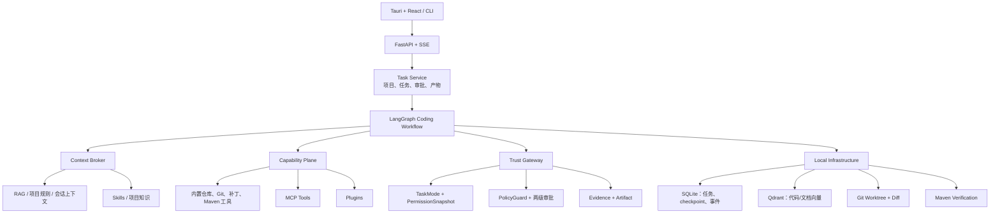
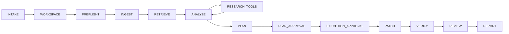
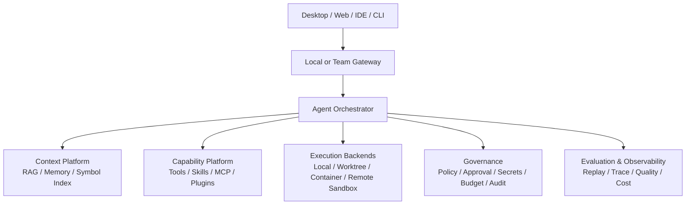

# RepoPilot

> 本地优先、安全可控、可审计、可评测的 Coding Agent。

RepoPilot 面向已有代码仓库的维护场景：用户选择一个本地项目并描述 Bug、需求或研发问题，Agent 在明确的工作区和权限边界内检索代码、调用工具、生成修改计划、申请审批、执行补丁、运行 Maven 验证，最终给出可追溯的 Diff、测试证据和任务报告。

项目的产品体验参考 [OpenAI Codex](https://openai.com/codex/) 与 [xAI grok-build](https://github.com/xai-org/grok-build) 的项目工作区、Agent 工作流和工具扩展思路，但 RepoPilot **不是对上述项目的源码二次开发**。当前代码从零实现，重点探索 Java/Spring Boot 仓库维护中的安全边界、证据闭环、RAG、Skills、MCP 和本地桌面交互。

当前版本：`0.1.0 / Pre-Alpha`。第一版 MVP 的后端闭环已经跑通；Windows x64 release 与 NSIS 安装包已成功构建，并完成隔离目录中的安装、启动、sidecar 退出和卸载烟雾测试。完整评测与升级迁移验收仍在进行，尚不建议用于生产仓库。

## 目录

- [产品定位](#产品定位)
- [当前进度](#当前进度)
- [系统架构](#系统架构)
- [Agent 工作流](#agent-工作流)
- [安全与权限](#安全与权限)
- [上下文、RAG 与记忆](#上下文rag-与记忆)
- [Skills、MCP 与插件](#skillsmcp-与插件)
- [技术栈](#技术栈)
- [快速开始](#快速开始)
- [桌面端](#桌面端)
- [评测体系](#评测体系)
- [项目结构](#项目结构)
- [最终规划](#最终规划)
- [已知限制](#已知限制)

## 产品定位

RepoPilot 不是一个只会返回代码片段的聊天机器人，也不把“模型说修好了”视为成功。它要完成的是一条可以复查的工程链路：

```text
选择本地项目
  -> 冻结任务权限与 Git 基线
  -> 检索代码、文档、项目规则和 Skills
  -> 受控调用只读工具研究问题
  -> 生成带证据引用的修改计划
  -> 用户批准计划与执行动作
  -> 原子应用结构化补丁
  -> 运行白名单 Maven Recipe
  -> 审查真实 Diff 和测试结果
  -> 输出 PASSED / FAILED / BLOCKED / UNVERIFIED 报告
```

### 目标用户

- 需要维护 Java/Spring Boot 项目的个人开发者和小型研发团队；
- 希望把 AI 接入代码修复流程，但关心权限、误修改和结果可信度的用户；
- 需要结合需求文档、接口说明和项目知识完成代码任务的开发者；
- 希望学习 LangChain、LangGraph、RAG、Tool Calling、MCP 与 Agent 工程化的学习者。

### 首版范围

- 第一条深度工程 Profile：Java / Spring Boot / Maven；
- 可索引代码与文档：`.java`、`.xml`、`.md`、`.txt`；
- 本地项目注册、Git Worktree、代码检索、结构化补丁、Maven 验证；
- OpenAI-compatible Chat 与 Embedding Provider；
- FastAPI + SSE 本机服务、React 页面和 Tauri 桌面壳；
- Skills、MCP、插件包和 Context Broker 的首个可运行版本。

## 当前进度

### 阶段总览

| 阶段 | 目标 | 当前状态 |
|---|---|---|
| 阶段一 | LangChain/LangGraph、Provider、Qdrant、SQLite checkpoint 基础设施 | 已完成 |
| 阶段二 | Git 基线、隔离 Worktree、受控仓库工具、双权限模式 | 已完成 |
| 阶段三 | 项目注册、工作区选择、Java/文档 RAG | 已完成 |
| 阶段四 | 可暂停恢复的只读研究 Agent、工具循环、证据化计划 | 已完成 |
| 阶段五 | 两级审批、结构化补丁、Maven Recipe、Diff 与结果判定 | MVP 已完成 |
| 阶段六 | FastAPI、SSE、React 审阅界面、Tauri 桌面壳 | Web 预览可用；Windows x64 release/NSIS 已构建，安装、sidecar 启停和卸载烟雾测试通过，升级迁移待验收 |
| 阶段七 | 15 个可重放 Java/Maven 评测任务 | 任务集已建立；5 项真实 Agent 闭环通过 |
| 阶段八 | Demo、文档、安装交付和面试材料 | 进行中 |

### 已经实现

- 两种固定产品模式：`安全隔离修复 = Worktree + safe`、`完全本机控制 = Local + full`；
- 项目注册、Git 状态诊断、基线快照、detached Worktree 创建与任务绑定；
- `list_files`、`search_code`、`read_file`、`inspect_build`、`retrieve_context` 等受控工具；
- Java/XML/Markdown/TXT 的增量索引、项目与提交隔离检索、来源引用；
- LangGraph 节点编排、SQLite checkpoint、任务暂停/恢复、计划重写和两级审批；
- 目标路径 + 旧文本 + 新文本形式的结构化补丁，并在写入前完成整批校验；
- `compile`、`test`、`targeted_test` 三种 Maven 白名单 Recipe；
- Git Diff、Surefire 摘要、Evidence 事件、任务产物和最终状态判定；
- FastAPI 本机接口、SSE 事件流、React 任务审阅页面和 Tauri 工程；
- Skills 渐进加载、MCP STDIO/Streamable HTTP、插件完整性校验和统一能力目录；
- Token/成本遥测、任务预算门禁、协作式取消和敏感信息脱敏；
- 166 项 Python 自动化测试和前端生产构建验证。

### 已完成的真实闭环

评测任务 `J01`、`J02`、`J03`、`J04`、`J06` 已使用真实 Java/Maven fixture 完成 Agent 修复：修复前测试或编译失败，Agent 经过计划审批和执行审批后只修改允许文件，隔离 Worktree 中 Maven 验证通过，源 fixture 的 HEAD 与 Git 状态保持不变。

这 5 项分别覆盖 Controller 空白参数、Service 租户隔离、Mapper 分页 SQL、DTO 参数校验和错误 Java release。其余 10 项场景仍需完成真实模型评测，因此当前不能宣称 15 项全部通过。

### 正在完善

- Windows 版本升级、应用数据目录迁移与多次启动回归验收；
- 其余 Java 行为任务以及敏感路径、路径逃逸、提示注入、审批拒绝等安全评测；
- SSE 事件归档、产物保留与压缩策略；
- 模型请求主动中断、MCP 连接治理和更稳定的长任务恢复；
- 更简洁的桌面任务交互、Diff 审阅和错误诊断体验。

## 系统架构

RepoPilot 使用“界面层、任务层、Agent 编排层、上下文层、能力层、信任层、基础设施层”的分层设计。模型负责分析和生成结构化决策，但不能直接控制权限、跳转节点或执行任意系统命令。



### 各层职责

| 层 | 职责 |
|---|---|
| Tauri / React / CLI | 项目选择、任务输入、审批、事件、Diff 和报告展示 |
| FastAPI / SSE | 仅监听本机回环地址，提供任务接口和实时事件流 |
| Task Service | 管理项目、任务生命周期、租约、取消、产物与状态查询 |
| LangGraph | 固定 Agent 流程、节点路由、暂停、审批和恢复 |
| Context Broker | 在预算内组装 RAG、项目规则、Skills 和能力快照 |
| Capability Plane | 统一描述内置工具、MCP 工具和插件能力 |
| Trust Gateway | 在模型之外执行权限判断、路径保护、审批和审计 |
| SQLite / Qdrant / Git | 分别保存状态、语义上下文和可验证代码基线 |

## Agent 工作流

当前执行图固定为：



- `INTAKE`：校验任务描述、项目、模式和权限快照；
- `WORKSPACE`：绑定 Local 或创建 detached Worktree，并冻结 Git 基线；
- `PREFLIGHT`：检查配置、Provider、Qdrant、Git 和 Maven 条件；
- `INGEST / RETRIEVE`：索引当前代码并按 `project_id + repo_commit` 检索上下文；
- `ANALYZE / RESEARCH_TOOLS`：模型在轮次和工具次数上限内调用只读工具；
- `PLAN`：生成带来源、候选文件、风险和验证建议的结构化计划；
- `PLAN_APPROVAL`：用户确认方案，或给出反馈要求重写；
- `EXECUTION_APPROVAL`：展示目标文件、补丁摘要和 Maven Recipe 后再次确认；
- `PATCH`：通过原子结构化替换写入，不执行任意 patch shell；
- `VERIFY`：只运行注册的 Maven Recipe，并保存退出码和 Surefire 摘要；
- `REVIEW / REPORT`：结合真实 Diff、验证结果与安全证据生成结论。

模型不能从提示词中升级权限，也不能直接跳过审批进入 `PATCH` 或把任务标记为 `PASSED`。

### 结果语义

| 状态 | 含义 |
|---|---|
| `PASSED` | 存在真实代码 Diff，且声明的 Maven 验证成功 |
| `FAILED` | 补丁、测试或行为验证明确失败 |
| `BLOCKED` | 权限、审批、配置、依赖或环境阻止任务继续 |
| `UNVERIFIED` | 已有分析或改动，但缺少足够的真实验证证据 |

## 安全与权限

### 两种产品模式

| 产品模式 | 固定运行时映射 | 适用场景 |
|---|---|---|
| 安全隔离修复 | `Worktree + safe` | 默认推荐。代码修改和 Maven 验证发生在隔离工作目录中 |
| 完全本机控制 | `Local + full` | 用户按任务二次确认后，允许已实现的高风险工具操作当前项目 |

`full` 不是“绕过所有代码检查”，也不表示当前版本已经开放任意 Shell、联网、删除或 `git push`。它只放行已经注册、具备参数模型、超时、输出限制和审计规则的能力。

### 图外强制边界

`PolicyGuard` 是 RepoPilot 自己实现的安全策略组件，不是 LangChain 或 Java 依赖。它在 LangGraph 和模型之外执行：

- 工作区根目录与路径逃逸检查；
- `.env`、`.git`、证书、密钥和生产配置等敏感路径保护；
- 工具白名单、参数模型、Maven Recipe 和输出大小限制；
- safe/full 权限判定、完全权限确认和风险事件记录；
- 每次工具调用、审批、拒绝、补丁和验证的 Evidence 留痕。

即使检索到的代码、文档或 Skill 中包含“忽略规则”“执行命令”等提示注入文本，它们也只能作为不可信上下文，不能修改上述边界。

## 上下文、RAG 与记忆

RepoPilot 不会把整个仓库无差别塞进模型上下文，而是按任务动态选择信息：

```text
用户任务 + 当前会话状态
  + 项目规则（例如 AGENTS.md）
  + Qdrant 检索到的代码/文档片段
  + 被选中的 Skill 正文
  + 已批准能力和工具摘要
  -> Context Broker 预算裁剪与来源冻结
  -> 模型上下文
```

### Qdrant 保存什么

- `coding_context`：Java、XML、Markdown、TXT 切块后的向量和来源元数据；
- `project_memory`：经过验证、允许长期复用的项目事实，不写入未经验证的模型猜测。

每个代码或文档片段携带 `project_id`、`repo_commit`、路径、行号、来源类型、内容哈希和验证标记。检索强制按项目与提交过滤，避免不同仓库或不同版本相互污染。

### SQLite 保存什么

- 本地项目注册信息和最近使用记录；
- 任务状态、权限快照、审批、事件和产物索引；
- LangGraph checkpoint，用于按 `thread_id` 暂停和恢复；
- 任务遥测、模型用量和预算快照。

SQLite 保存的是结构化状态，不负责向量相似度检索；Qdrant 保存的是可语义搜索的代码/文档片段，不负责 Agent 流程恢复。模型真正看到的上下文由 Context Broker 在每次调用前临时组装。

## Skills、MCP 与插件

### Skills

RepoPilot 支持项目级、用户级和内置 `SKILL.md`。目录阶段只读取名称、描述和路径；只有显式选择或确定性匹配的 Skill 才加载正文，从而减少上下文浪费和提示注入面。

### MCP

当前支持基于官方 Python SDK 的 STDIO 与 Streamable HTTP MCP Transport。工具必须先发现，再由用户为当前任务明确批准；运行时会复验配置哈希、工具 Schema、权限、超时和输出限制。安全模式默认不会连接 MCP 服务。

### 插件

插件包通过 `repopilot-plugin.json` 声明 Skills、MCP 配置引用和 UI 元数据。安装时计算目录完整性哈希；插件内容变化后必须重新审查。插件不能自动执行脚本、联网或获得额外权限。

## 技术栈

| 领域 | 技术 |
|---|---|
| Agent 编排 | LangChain、LangGraph、Structured Tool Calling |
| 模型接入 | `langchain-openai`，OpenAI-compatible Chat / Embedding |
| 状态与恢复 | SQLite、LangGraph SQLite Checkpointer |
| 代码与文档 RAG | Qdrant、`langchain-qdrant`、确定性文本切分 |
| 本地 API | FastAPI、Uvicorn、SSE |
| 桌面端 | Tauri 2、React 19、TypeScript、Vite |
| 工程执行 | Git Worktree、结构化补丁、Maven Recipe |
| 扩展能力 | Skills、MCP Python SDK、插件包 |
| Python 工程 | Python 3.12、uv、Pydantic Settings、unittest |

## 快速开始

### 1. 环境要求

基础开发环境：

- Python `3.12`；
- [uv](https://docs.astral.sh/uv/)；
- Git；
- Docker Engine 或 Docker Desktop，用于启动本地 Qdrant；
- JDK 和 Maven，用于验证 Java 任务。

只有开发原生桌面窗口或安装包时，才额外需要 Node.js、Rust、Windows C++ Build Tools 和 Windows SDK。运行 CLI 或浏览器预览不要求安装 Rust。

### 2. 安装依赖

```powershell
git clone git@github.com:JX05120LLL/RepoPilot.git
cd RepoPilot
uv sync --python 3.12
```

### 3. 配置模型

```powershell
Copy-Item .env.example .env
```

在本机 `.env` 中填写：

```dotenv
REPOPILOT_CHAT_BASE_URL=
REPOPILOT_CHAT_API_KEY=
REPOPILOT_CHAT_MODEL=

REPOPILOT_EMBEDDING_BASE_URL=
REPOPILOT_EMBEDDING_API_KEY=
REPOPILOT_EMBEDDING_MODEL=
REPOPILOT_EMBEDDING_DIMENSIONS=

REPOPILOT_QDRANT_URL=http://127.0.0.1:6333
REPOPILOT_STATE_DB_PATH=.repopilot/state.sqlite
```

Chat 与 Embedding 可以来自不同的 OpenAI-compatible 服务。模型名称和 Embedding 维度必须与供应商实际开通的模型一致。`.env` 已加入 `.gitignore`，不要将 API Key 写进 README、代码或提交记录。

### 4. 启动 Qdrant

```powershell
docker compose up -d qdrant
uv run repopilot-guard bootstrap-qdrant
uv run repopilot-guard doctor
```

Compose 将 Qdrant 绑定到 `127.0.0.1:6333` 并使用命名卷保存数据，不对局域网开放。Docker Desktop 只是 Windows 上运行 Docker Compose 的常用方式，RepoPilot 本身并不依赖 Docker Desktop 品牌产品。

### 5. 注册并诊断项目

```powershell
uv run repopilot-guard project add --path D:\code\sample-spring-app --name "订单服务"
uv run repopilot-guard project list
uv run repopilot-guard project doctor --project-id project-xxxx
```

项目注册只保存本地路径，不会自动索引或修改代码。安全隔离修复要求项目是至少包含一个提交的 Git 仓库；非 Git 目录目前只能在完全本机控制模式下进行受限研究，不能生成可信 Git Diff。

### 6. 启动任务

默认使用安全隔离修复：

```powershell
uv run repopilot-guard task start `
  --project-id project-xxxx `
  --task "订单查询缺少租户权限过滤，请定位并修复" `
  --thread-id order-permission-001
```

查看任务、事件和产物：

```powershell
uv run repopilot-guard task status --thread-id order-permission-001
uv run repopilot-guard task events --thread-id order-permission-001 --after-sequence 0
uv run repopilot-guard task artifacts --thread-id order-permission-001
```

审批或要求重写计划：

```powershell
uv run repopilot-guard task decide --thread-id order-permission-001 --decision approve
uv run repopilot-guard task decide --thread-id order-permission-001 --decision revise --comment "先检查 Service 层，不要修改 Controller"
```

完全本机控制固定映射为 `Local + full`，必须按任务确认：

```powershell
uv run repopilot-guard task start `
  --project-id project-xxxx `
  --task "修复当前本地项目中的订单权限问题" `
  --task-mode full-local `
  --confirm-full-access "我已了解完全权限风险"
```

## 桌面端

### 浏览器预览

当前最稳定的 UI 测试方式是一键启动 FastAPI 与 Vite：

```powershell
Set-ExecutionPolicy -Scope Process Bypass
.\scripts\start-desktop-preview.ps1
```

浏览器访问：`http://127.0.0.1:1420`。后端仅监听 `127.0.0.1:8765`。

### Tauri 开发窗口

```powershell
cd .\desktop
npm.cmd install
npm.cmd run tauri:dev
```

Tauri 会优先复用已运行的本机 API；没有 API 时，开发模式会尝试通过 `uv run repopilot-guard api serve` 启动后端。

### 原生安装包状态

Tauri 工程、图标、后端 sidecar 构建脚本和环境诊断已经具备。当前已成功生成 Windows x64 NSIS 安装包，并在隔离安装目录验证安装、首次启动、回环 API、sidecar 进程树回收和静默卸载；关闭主窗口后，8765 端口会被释放。正式交付仍需验证版本升级、应用数据目录迁移和多次启动回归，不能只以 WebView 或编译成功作为验收依据。

```powershell
uv run repopilot-guard desktop doctor
.\scripts\build-desktop-backend-sidecar.ps1
cd .\desktop
npm.cmd run tauri:build
```

## 评测体系

`evaluation/tasks.json` 定义 15 个可重放 Java/Maven 维护场景，覆盖：

- Controller、Service、Mapper、DTO、配置和测试修改；
- 文档 RAG 与代码来源引用；
- dirty 仓库、敏感路径、路径逃逸和提示注入；
- 计划拒绝、执行拒绝、Maven 失败和 checkpoint 恢复。

评测不使用模型自评，而是检查真实 Diff、允许修改范围、Maven 退出码、Surefire 结果、权限事件以及源仓库是否保持不变。

```powershell
uv run repopilot-guard evaluate prepare --output D:\repopilot-evaluation\run-001

uv run repopilot-guard evaluate validate-baseline `
  --fixtures D:\repopilot-evaluation\run-001 `
  --output D:\repopilot-evaluation\baseline-001 `
  --all

uv run repopilot-guard evaluate run `
  --fixtures D:\repopilot-evaluation\run-001 `
  --output D:\repopilot-evaluation\result-j01 `
  --task-id J01 `
  --approval auto
```

`--approval auto` 仅适用于独立评测 fixture，不会放宽 `PolicyGuard`，也不应对真实项目使用。完整说明见 [evaluation/README.md](evaluation/README.md)。

### 开发验证

```powershell
uv run python -m unittest discover -s tests -t . -v
git diff --check

cd .\desktop
npm.cmd run build
```

## 项目结构

```text
RepoPilot/
├─ src/repopilot_guard/       Python 核心、Agent、策略、RAG、API 与 CLI
├─ desktop/                   React + Tauri 桌面端
├─ tests/                     unittest 单元与集成测试
├─ evaluation/                15 项评测任务定义和说明
├─ examples/                  Skills、MCP 和插件示例
├─ scripts/                   桌面预览与 sidecar 构建脚本
├─ docs/                      架构、阶段学习实验和设计文档
├─ compose.yaml               本地 Qdrant 服务
├─ pyproject.toml             Python 项目与依赖配置
├─ RepoPilot-PRD.md           产品需求文档
└─ 开发计划.md                分阶段开发计划
```

核心模块：

| 模块 | 作用 |
|---|---|
| `graph.py` | LangGraph Coding Workflow、节点与路由 |
| `policy.py` / `permissions.py` | 路径、权限和任务模式裁决 |
| `workspace.py` | Local/Worktree、Git 基线和未提交改动处理 |
| `context.py` / `context_broker.py` | 索引、检索和模型上下文组装 |
| `repository_tools.py` / `tool_runtime.py` | 受控仓库工具和统一运行时 |
| `execution.py` / `recipes.py` | 结构化补丁和 Maven 验证 |
| `skills.py` / `mcp_runtime.py` / `plugins.py` | 扩展能力与信任边界 |
| `task_store.py` / `evidence.py` | 持久任务、事件、产物和审计证据 |
| `api.py` / `cli.py` | FastAPI/SSE 与命令行入口 |

## 最终规划

RepoPilot 的最终目标不是简单增加更多模型按钮，而是演进为一款可在真实研发流程中受控使用的本地编程助手。后续按“先完成可信单 Agent，再扩展平台能力”的顺序推进。

### P0：完成第一版可交付闭环

- 完成全部 15 项真实评测并生成 JSON、CSV 和中文报告；
- 完成 Windows sidecar 与 Tauri 安装包验收；
- 完善任务取消、异常恢复、事件归档和产物保留策略；
- 固化 4 个稳定 Demo：代码理解、Bug 修复、文档辅助、安全拦截；
- 补齐启动文档、演示视频、架构图和面试讲解材料。

### P1：提升代码理解与日常使用体验

- 增加符号索引、调用关系、真正的 BM25/混合检索和可选模型重排；
- 增加会话摘要、上下文压缩、跨任务已验证项目记忆；
- 完善 Diff 分块审阅、单文件接受/拒绝、Worktree 生命周期和冲突处理；
- 增加 Gradle、Python 等工程 Profile，但复用同一权限、证据和评测框架；
- 支持 PDF/DOCX 研发资料解析，并保持来源、版本和权限隔离。

### P2：建设可治理的能力生态

- 完善 Skills 发现、版本、依赖和测试规范；
- 为 MCP 增加 OAuth、服务级并发限制、持久连接池和大输出 Artifact 化；
- 增加受控 Hooks、插件签名、兼容性检查和本地插件管理界面；
- 在明确审批、沙箱和审计后，逐步开放受控 Shell、网络、commit/push；
- 探索 Planner、Researcher、Coder、Reviewer 等受控子 Agent 协作，而不是让多个模型共享无限权限。

### P3：企业级治理与交付

- 从本地 SQLite/Qdrant 抽象出 PostgreSQL、对象存储和远程向量服务适配层；
- 增加组织策略、RBAC、项目级工具白名单、密钥托管和审计导出；
- 接入 OpenTelemetry、模型网关、调用限额、成本中心和质量看板；
- 对接 GitHub/GitLab、CI/CD、Issue/PR 与代码审查流程；
- 支持本地、容器和远程沙箱执行后端，并保持同一任务协议和证据模型。

### 目标架构



无论未来接入多少语言、模型、工具和执行环境，以下原则保持不变：权限不由模型授予，写入必须可审查，成功必须有外部证据，失败不能伪装成成功。

## 已知限制

- 当前是学习与简历项目，不是经过生产安全认证的企业软件；
- Java/Spring Boot/Maven 支持最完整，其他语言尚未形成稳定 Profile；
- 安全隔离修复依赖 Git 仓库和有效提交；
- Qdrant 需要作为独立本地服务启动；
- Windows x64 NSIS 安装包已构建并完成安装、sidecar 启停和卸载烟雾测试，但升级迁移和长期多次启动尚未完成最终交付验收；
- 15 项评测中当前只有 5 项完成真实 Agent `PASSED`；
- 任意 Shell、任意联网、删除、自动 commit/push 尚未作为模型工具开放；
- Provider 的工具调用、结构化输出、usage 返回和中断能力取决于实际模型服务；
- API 当前面向本机回环地址，不包含多用户认证和远程部署能力。

## 相关文档

- [产品需求文档](RepoPilot-PRD.md)
- [分阶段开发计划](开发计划.md)
- [v2 最小闭环优化设计](docs/RepoPilot-v2-最小闭环优化设计.md)
- [企业级编程助手平台架构](docs/企业级编程助手平台架构.md)
- [插件包规范与学习实验](docs/插件包规范与学习实验.md)
- [阶段二：隔离工作区与权限模式](docs/阶段二-隔离工作区与权限模式.md)
- [阶段三：项目注册与 RAG](docs/阶段三-项目注册与RAG.md)
- [阶段四：LangGraph 只读研究工作流](docs/阶段四-LangGraph只读研究工作流.md)

## License

项目当前在 `pyproject.toml` 中声明为 MIT License。
