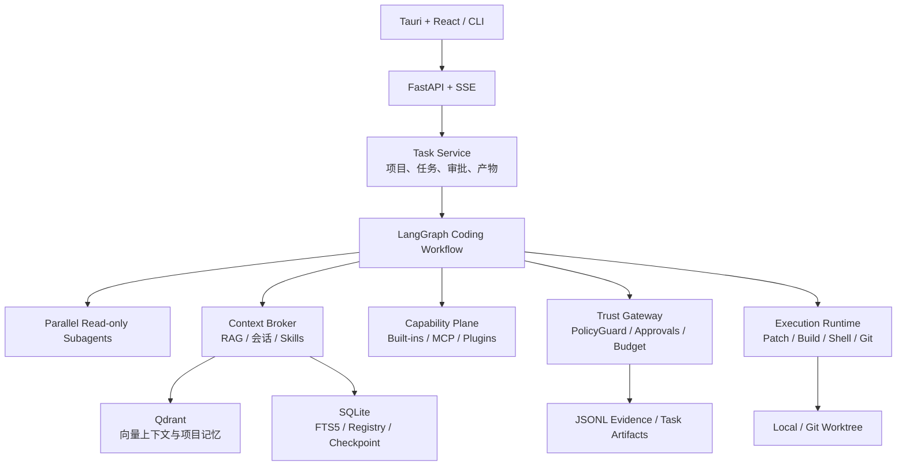

# RepoPilot

> Local-first、可审计、可验证的 Coding Agent。

当前桌面版 `v0.1.23` 已将对话体验分为普通问答、只读代码研究和受控代码修改：要求详细项目分析、流程、调用链或“结合代码”时会自动进入只读研究，并在会话中输出带文件证据的结论；只有修改任务才进入审批、补丁与验证流程。

RepoPilot 面向已有代码仓库的真实维护工作：选择本地项目，描述 Bug、需求或研发问题，Agent 在明确的工作区、权限和预算边界内完成代码理解、方案制定、补丁修改、构建验证与交付审阅。

它参考 Codex 和 grok-build 的项目工作区、工具调用和任务流设计思路，但并非基于任何现有 Coding Agent 源码二次开发。RepoPilot 从零实现，重点关注 Java/Spring Boot 仓库维护场景中的安全边界、证据闭环、RAG、Skills、MCP 和本地桌面体验。

## 为什么使用 RepoPilot

普通 AI 编程对话往往只给出“看起来合理”的代码。RepoPilot 将一次代码任务做成可复查的工程流程：

```text
选择项目
  -> 冻结权限、工作区与 Git 基线
  -> 检索代码、文档、Skills 和项目记忆
  -> 并行只读子 Agent 取证
  -> 主 Agent 生成带来源引用的计划
  -> 计划审批与执行审批
  -> 原子应用结构化补丁
  -> 执行受控构建/测试或已审批 Shell 命令
  -> 输出 Diff、验证证据、审计事件与最终报告
```

`PASSED` 不来自模型的自我判断，而必须同时具备真实 Diff 和真实验证证据。无法验证时，任务会如实标记为 `UNVERIFIED`、`FAILED` 或 `BLOCKED`。

## 核心能力

### 两种任务模式

| 模式 | 工作区 | 权限 | 适用场景 |
|---|---|---|---|
| 安全隔离修复 | Git detached Worktree | `safe` | 默认推荐。适合修 Bug、小需求、评测和首次接入项目。 |
| 完全本机控制 | 原始 Local 项目 | `full` | 适合明确授权后的本机开发交付操作。 |

安全隔离修复默认不修改源仓库。完全本机控制必须按任务填写确认语句，并在每次高风险动作前再次展示审批信息。

### Coding Agent 工作流

- LangGraph 可恢复任务图，SQLite checkpoint 按 `thread_id` 保存审批点和执行状态；
- 代码研究、计划审批、补丁预览、执行审批、验证、审阅和报告形成固定流程；
- 结构化补丁使用“目标文件 + 预期旧文本 + 新文本”，所有修改先校验、后原子写入；
- Java/Maven、Java/Gradle、Python/pytest、Node.js/npm/pnpm 使用固定 Recipe 执行验证；
- 真实 Git Diff、测试摘要、Evidence 事件和任务产物可在桌面端、CLI 或 API 中审阅；
- 支持计划重写、任务取消、断线恢复、终态归档和经哈希校验的证据导出。

### 多 Agent 只读协作

复杂任务会自动并行运行三个只读子 Agent：

- **仓库结构 Agent**：梳理模块、文件和工程入口；
- **实现定位 Agent**：根据任务描述搜索代码和候选实现；
- **验证路径 Agent**：识别构建描述、测试位置和验证入口。

子 Agent 固定使用 `safe` 权限和只读工具，不能继承 Shell、MCP、补丁、Git 写入或父任务的完全权限。主 Agent 只接收可引用的来源摘要，再统一制定计划，避免多个执行者并发修改同一份代码。

### RAG、文档与记忆

- 使用 Qdrant 存储可语义检索的代码、研发文档和已验证项目事实；
- SQLite FTS5 提供本地 BM25 倒排检索，与向量、关键词、路径和 Java 声明符号进行稳定混合重排；
- 按 `project_id + repo_commit` 强制隔离上下文，避免不同项目或不同提交串扰；
- 代码、Markdown、TXT、PDF、DOCX 可进入受控索引；PDF/DOCX 会先解析为本机 UTF-8 文本副本；
- 加密 PDF、扫描件无文本、异常 DOCX 压缩包、超限内容、敏感路径和二进制文件会被阻断；
- 只有真实 Diff 与验证共同证明的事实才允许进入 `project_memory` 长期记忆。

### Skills、MCP 与插件

- 支持项目级、用户级、内置级 Skill 发现与渐进加载；
- 支持 MCP STDIO 与 Streamable HTTP，工具 Schema、输出上限、连接状态和任务授权均可审计；
- 插件包支持 SHA-256、版本兼容性、Ed25519 签名、可信发布者和本地 Git 来源锁；
- 声明式 Hooks 只能在固定生命周期表达 `allow / ask / deny`，不支持插件脚本、任意命令或隐式增权；
- 模型、检索文档、Skill、MCP 输出和插件元数据均按不可信输入处理，不能改变权限或工作流。

### 完全本机 Shell 与 Git 交付

在启用功能开关、选择完全本机控制、完成任务确认并授权 `shell` 能力后，RepoPilot 可提议并执行：

- `cmd`、PowerShell、Bash 等解释器命令；
- 网络和包管理命令；
- `git add`、`git commit`、`git push` 等本机交付动作；
- 项目外工作目录与其他高影响主机操作。

这不是无提示的后台执行。每条命令都使用结构化 `argv` 保存，先生成脱敏预览、工作目录、超时、风险标签和冻结哈希；Shell 解释器、网络、Git 提交/推送等操作需要独立风险审批，随后仍需通过执行审批。命令输出会脱敏并截断，任务支持取消、超时和子进程树清理。

## 架构


```mermaid
flowchart TB
    UI["Tauri + React / CLI"] --> API["FastAPI + SSE"]
    API --> TASK["Task Service\n项目、任务、审批、产物"]
    TASK --> GRAPH["LangGraph Coding Workflow"]

    GRAPH --> SUB["Parallel Read-only Subagents"]
    GRAPH --> CONTEXT["Context Broker\nRAG / 会话 / Skills"]
    GRAPH --> CAPS["Capability Plane\nBuilt-ins / MCP / Plugins"]
    GRAPH --> TRUST["Trust Gateway\nPolicyGuard / Approvals / Budget"]
    GRAPH --> EXEC["Execution Runtime\nPatch / Build / Shell / Git"]

    CONTEXT --> QDRANT["Qdrant\n向量上下文与项目记忆"]
    CONTEXT --> SQLITE["SQLite\nFTS5 / Registry / Checkpoint"]
    EXEC --> WORKSPACE["Local / Git Worktree"]
    TRUST --> EVIDENCE["JSONL Evidence / Task Artifacts"]
```

| 层 | 职责 |
|---|---|
| Tauri / React / CLI | 项目选择、对话、审批、实时事件、Diff 和报告展示。 |
| FastAPI / SSE | 仅监听本机回环地址，提供本地 API 与事件流。 |
| LangGraph | 编排可暂停、可恢复、不可越权的 Coding Workflow。 |
| Context Broker | 统一装配 RAG、项目规则、Skills、会话摘要和上下文预算。 |
| Capability Plane | 管理内置工具、Skills、MCP 和插件能力的来源、风险和授权。 |
| PolicyGuard / ToolRuntime | 在模型外执行路径、敏感文件、参数、权限和超时校验。 |
| Workspace Runtime | 管理 Git 基线、Worktree、Diff、补丁、构建和 Shell 进程。 |
| Qdrant / SQLite / JSONL | 分别承担语义检索、状态持久化和审计证据。 |

## 技术栈

- Python 3.12、`uv`、FastAPI、Pydantic Settings；
- LangChain、LangGraph、OpenAI-compatible Provider；
- Qdrant、SQLite、FTS5；
- Git Worktree、Maven、Gradle、pytest、npm/pnpm Recipe；
- MCP、Ed25519、JSON Schema、JSONL Evidence；
- React、TypeScript、Vite、Tauri 2、Rust。

## 快速开始

### 前置条件

- Windows 10/11 x64；
- Python 3.12；
- [uv](https://docs.astral.sh/uv/)；
- Git；
- Docker Desktop 或可用 Docker Engine（用于运行 Qdrant）；
- Node.js 20+（桌面预览/构建）；
- Rust stable 与 Windows C++ Build Tools（仅原生 Tauri 打包需要）；
- 真实模型和 Embedding 的 OpenAI-compatible API 配置。

### 1. 安装依赖

```powershell
git clone git@github.com:JX05120LLL/RepoPilot.git
cd RepoPilot
uv sync
Copy-Item .env.example .env
```

在 `.env` 中填写 Chat、Embedding 的 Base URL、API Key、模型名和维度。不要将 `.env` 提交到 Git。

```dotenv
REPOPILOT_CHAT_BASE_URL=https://your-openai-compatible-endpoint/v1
REPOPILOT_CHAT_API_KEY=
REPOPILOT_CHAT_MODEL=

REPOPILOT_EMBEDDING_BASE_URL=https://your-embedding-endpoint/v1
REPOPILOT_EMBEDDING_API_KEY=
REPOPILOT_EMBEDDING_MODEL=
REPOPILOT_EMBEDDING_DIMENSIONS=1024

REPOPILOT_QDRANT_URL=http://127.0.0.1:6333
REPOPILOT_STATE_DB_PATH=.repopilot/state.sqlite
```

### 2. 启动本地基础设施

```powershell
docker compose up -d qdrant
uv run repopilot-guard bootstrap-qdrant
uv run repopilot-guard doctor
```

Qdrant 只绑定 `127.0.0.1:6333`，不会暴露到局域网。

### 3. 启动桌面预览

```powershell
uv run repopilot-guard desktop preview
```

浏览器会打开本机预览。Tauri 桌面端会自动启动同一套本地 FastAPI sidecar，不需要单独部署后端。

### 4. 使用 CLI

```powershell
# 注册并诊断项目
uv run repopilot-guard project add --repo D:\code\your-project
uv run repopilot-guard project list
uv run repopilot-guard project doctor --project-id <project-id>

# 索引项目代码或导入研发文档
uv run repopilot-guard index project --project-id <project-id>
uv run repopilot-guard document add --project-id <project-id> --file D:\docs\requirements.docx

# 启动安全隔离修复任务
uv run repopilot-guard task start --project-id <project-id> --task "修复订单查询的租户隔离问题"
```

完整命令入口可通过以下命令查看：

```powershell
uv run repopilot-guard --help
uv run repopilot-guard task --help
uv run repopilot-guard desktop --help
```

### 5. 启用完全本机 Shell

在 `.env` 或桌面端设置中启用：

```dotenv
REPOPILOT_FULL_LOCAL_SHELL_ENABLED=true
```

重启本地服务后，创建“完全本机控制”任务，完成确认并勾选 `shell` 能力。Shell、网络、Git 提交和推送始终以单条命令预览和独立高风险审批为准。

## 桌面端

桌面端提供：

- 本地文件夹选择与自动项目注册；
- 对话、分析代码、修改代码共享会话上下文；
- 智能模式使用 DeepSeek 结构化意图路由，并以本地规则兜底；低置信度路由必须由用户确认；
- Markdown/TXT/PDF/DOCX 研发文档导入与任务附件；
- 安全隔离修复、完全本机控制两种模式；
- 流式回答、可折叠工具时间线、来源卡片、计划与双重审批；
- Diff、构建验证、Evidence、任务产物和 Worktree 审阅；
- 模型、Embedding、Qdrant、Skills、插件和 MCP 的本机设置页。

构建 Windows NSIS 安装包：

```powershell
cd desktop
& "D:\Node-JS\node.exe" ".\node_modules\@tauri-apps\cli\tauri.js" build
```

生成的安装包位于：

```text
desktop/src-tauri/target/release/bundle/nsis/
```

## 评测与质量

仓库包含可重放的维护任务与安全断言，覆盖 Java/Maven 修复、参数校验、权限隔离、测试补充、敏感路径、路径逃逸、审批拒绝、Maven 失败和恢复任务等场景。

```powershell
# Python 自动化测试
uv run python -m unittest discover -s tests -t . -v

# 评测 fixture 校验与执行
uv run repopilot-guard evaluate --help
```

当前自动化测试覆盖控制面、RAG、文档解析、工作区隔离、补丁原子性、Maven/Gradle/pytest/Node Recipe、MCP/插件、Shell/Git 审批、子 Agent 并行取证、API/SSE 和桌面端配置边界。

## 安全边界

- 默认使用安全隔离修复，源仓库 dirty 时不会自动 stash、commit、reset 或 clean；
- `PolicyGuard` 始终在模型和 LangGraph 之外执行，模型无法自行增权、跳过审批或改变节点流转；
- `.env`、`.git`、证书、私钥、生产配置和敏感路径默认拒绝；
- API Key 不进入 Git、Qdrant、SQLite 审计字段、SSE 或任务报告；
- 文档、代码注释、MCP 输出和 Skill 正文都按提示注入不可信数据处理；
- 全部高风险命令需要任务级确认和不可变预览哈希，命令漂移会阻断；
- 完全本机控制不是 OS 沙箱。它代表用户明确允许 Agent 以当前 Windows 用户权限执行已审批命令。

## 已知限制

- RepoPilot 是个人学习和作品集项目，不是经过生产安全认证的企业软件；
- Java/Spring Boot/Maven 支持最完整；其他 Profile 提供最小受控闭环，实际可用性取决于本机运行时；
- PDF 仅支持可提取文本的文件，不包含 OCR；不支持旧版 `.doc`；
- 第一版子 Agent 是固定角色的并行只读研究员，不是多个独立 LLM 互相对话、自动谈判的协作系统；
- 完全本机 Shell 功能强大但不提供操作系统级隔离，不应对不可信项目或生产机器轻率启用；
- Qdrant 需要作为独立本地服务运行；
- Windows 安装包尚未配置代码签名、自动更新和企业级部署通道；
- 本地 API 仅面向回环地址，不提供多用户身份认证或远程部署。

## 仓库结构

```text
src/repopilot_guard/    Python Agent、策略、RAG、MCP、执行与 API
desktop/                React + Tauri 桌面端
tests/                  unittest 自动化测试
evaluation/             可重放任务、fixture 和评测报告
examples/               插件、Skill 与 MCP 示例
scripts/                桌面 sidecar 与发布辅助脚本
```

## 文档

- [产品需求说明](RepoPilot-PRD.md)
- [开发设计记录](开发计划.md)
- [评测说明](evaluation/README.md)

## License

MIT
