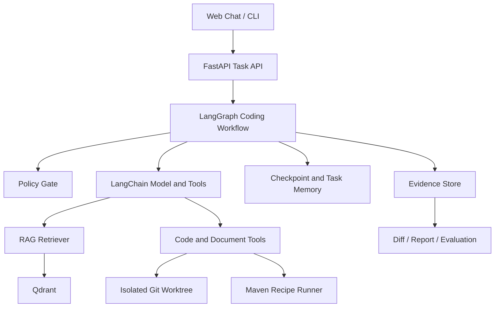

# RepoPilot Guard PRD

> 产品工作名：`RepoPilot Guard`。它不是通用聊天助手，也不是 IDE 替代品，而是一个专注代码开发与工程文档协作的安全 Coding Agent。

## 1. 项目概述

RepoPilot Guard 是一个面向 Java/Spring Boot 仓库的 Web Coding Agent。用户可从聊天入口提交代码任务、仓库路径和研发文档；Agent 在隔离 Git worktree 中检索代码与文档上下文、分析问题、生成计划和补丁、运行受控 Maven 测试，并提供可审计的 diff、测试证据与报告。

它的差异化不在于“让模型拥有任意 Shell”，而在于以下工程闭环：

- 代码优先：所有主任务都围绕读代码、改代码、测代码、解释代码和生成工程文档；
- RAG 上下文：仓库代码、`README`、设计文档、接口文档和用户上传资料共同构成带来源引用的上下文；
- 图式编排：LangGraph 将预检、检索、分析、计划、人工确认、补丁、测试与报告组织为可暂停、可恢复的状态图；
- 安全执行：工具白名单、敏感文件保护、worktree 隔离、Maven Recipe 和人工确认共同限制 Agent 行为；
- 真实证据：测试退出码、diff、事件轨迹和原始上下文来源决定结论，测试未通过绝不报告成功；
- 可评测：固定代码任务集衡量修复能力、检索能力、文档辅助收益、安全拦截和成本。

## 2. 产品定位

### 2.1 一句话定位

RepoPilot Guard 是一个基于 LangChain、LangGraph 和 Qdrant 的安全 Coding Agent，专注 Java/Spring Boot 仓库的代码维护、代码理解和工程文档协作。

### 2.2 目标能力

1. 代码维护

   定位 Bug、分析调用链、提出修复计划、生成补丁、在 worktree 中应用修改、运行 Maven Recipe 并给出验证结论。

2. 代码上下文问答

   基于当前仓库和受控检索回答“鉴权在哪实现”“订单链路如何流转”“某接口为何返回错误”等问题，并附上文件、行号或文档来源。

3. 研发文档协作

   用户上传需求说明、接口约定、设计文档、错误日志或会议纪要后，Agent 可将其作为代码任务上下文；也可基于仓库和已检索证据生成需求文档、技术方案、接口说明、测试计划和变更报告草稿。

4. 记忆与连续任务

   同一任务可在补丁确认、测试失败或浏览器刷新后恢复；同一项目可检索经过验证的架构决策、构建命令、历史任务总结和已知限制。

### 2.3 明确边界

- 不是通用“帮我写任何文章”的助手；文档能力必须服务代码、需求、设计、接口、测试或变更说明；
- 首版只深度支持 Java/Spring Boot + Maven，Gradle 和 Python 属于后续 Profile；
- 不提供任意终端、浏览器自动化、部署、数据库迁移、`git commit` 或 `git push`；
- 不自动把聊天文本或上传文档视为可执行指令；权限始终由系统策略决定；
- 不承诺大范围重构、跨仓库联动或完全无人值守。

## 3. 目标用户与核心场景

### 3.1 目标用户

- 正在维护 Java/Spring Boot 项目的后端开发者；
- 需要结合需求文档和现有代码完成小型改动的开发者；
- 需要展示 Agent、RAG、Java 工程理解和安全执行能力的个人开发者；
- 希望对固定维护任务比较模型和策略效果的小型团队。

### 3.2 核心场景

| 场景 | 输入 | Agent 输出 | 必须具备的证据 |
|---|---|---|---|
| Bug 修复 | 仓库 + Bug 描述 | 根因、计划、补丁、测试结论 | 相关文件、diff、测试输出 |
| 文档辅助改动 | 仓库 + 需求/API 文档 | 需求影响分析、改动计划、补丁 | 文档片段来源、代码来源、测试 |
| 代码理解 | 仓库 + 自然语言问题 | 带引用的解释或调用链摘要 | 文件/行号与检索来源 |
| 文档生成 | 仓库 + 对话/上传资料 | PRD、技术方案、接口说明或测试计划草稿 | 引用的代码和资料来源 |
| 评测 | 固定任务集 | 指标汇总与失败分析 | 可回放事件、任务版本、测试结果 |

## 4. MVP 目标与非目标

### 4.1 MVP 目标

- 提供本地 Web 聊天入口，支持仓库路径、代码任务和研发文档上传；
- 支持 `.md`、`.txt`、`.pdf`、`.docx` 的受限解析、索引、检索和来源展示；
- 使用 LangChain 统一模型、嵌入、文档加载、文本切分、检索器与结构化工具；
- 使用 LangGraph 编排任务状态、检查点、人工确认、中断恢复和短期会话记忆；
- 使用 Qdrant 保存仓库代码、工程文档和项目长期记忆向量，并按项目、提交、文件路径和来源类型过滤；
- 支持 Java/Maven 仓库预检、worktree 隔离、代码搜索、文件读取、补丁、Maven 测试和 Git diff；
- 支持生成工程文档草稿，写入仓库前必须展示 diff 并经用户确认；
- 对工具调用、检索来源、补丁、测试、审批和最终状态进行审计；
- 至少完成 15 个可重复运行的 Java 代码维护任务评测，其中至少 5 个任务使用上传文档或项目文档作为辅助上下文。

### 4.2 非目标

- 不做通用办公/写作助手，不处理与软件工程无关的开放领域任务；
- 不做多 Agent 团队、自动 PR、远程部署、数据库迁移、支付或生产运维；
- 不让模型执行原始 Shell、任意网络请求或未注册工具；
- 不支持扫描用户全盘文件；索引和读取范围仅限用户选择的仓库、上传文件和 Agent 产物目录；
- 不将敏感文件、密钥、生产配置或未经确认的记忆写入向量数据库；
- 不训练自己的基础模型。

## 5. 核心流程

```text
用户聊天输入 + 仓库 + 可选研发文档
  -> 上传校验与文档解析
  -> 仓库预检与 worktree 创建
  -> 代码/文档索引与上下文检索
  -> LangGraph 分析、计划与工具选择
  -> 用户确认补丁或文档草稿
  -> worktree 应用补丁 / 写入受控文档
  -> Maven Recipe 验证
  -> 测试失败时有限修复循环
  -> 生成带来源、diff、测试证据的报告
```

### 5.1 用户故事

作为开发者，我上传“订单权限规则.md”并输入“订单查询存在跨店铺数据泄露”，希望 Agent 能从文档提取权限约束、从仓库定位查询链路、提出补丁，在 worktree 中测试，并说明引用了哪些文档和代码。

作为开发者，我希望问“根据当前订单模块和上传的需求说明，生成订单退款功能 PRD 草稿”，系统只使用检索到的工程上下文生成草稿，并标明不确定项与来源。

作为评测者，我希望比较“仅代码检索”和“代码 + 文档检索”在固定 Bug 任务上的定位命中率、测试通过率和成本差异。

## 6. 系统架构



### 6.1 LangChain 职责

- `ChatModel` 和 `EmbeddingModel` 的 Provider 抽象；
- 文档 Loader：读取允许的本地 Markdown、文本、PDF、Word 文档；
- Text Splitter：按代码结构、Markdown 标题和文档段落切分；
- Retriever：从 Qdrant 检索代码、项目文档和长期记忆；
- Structured Tool：以结构化参数调用 `search_code`、`read_file`、`retrieve_context`、`apply_patch`、`run_recipe` 等受控工具；
- Prompt 模板：要求模型区分事实、推断、计划和未验证结论，并在回答中引用来源。

### 6.2 LangGraph 职责

LangGraph 负责 Agent 的流程与可恢复状态，而不是替代安全策略。图状态至少包含：

```text
messages, task, repository_snapshot, worktree_path,
uploaded_documents, retrieved_context, plan, pending_approval,
tool_events, patch_candidates, test_results, verdict
```

核心节点：

```text
intake -> preflight -> ingest_context -> retrieve -> analyze -> plan
                                                     |
                                              approval gate
                                                     |
                           patch -> test -> repair -> review -> report
```

- `approval gate` 使用 LangGraph 中断/恢复能力，等待用户批准补丁、文档写入或高成本测试；
- 每个关键节点保存 checkpoint，浏览器刷新、服务重启或测试失败后可从上一个安全节点继续；
- `repair` 受最大循环次数、最大修改文件数和最大测试次数限制；
- 任何节点提出的工具动作都必须先通过 `PolicyGuard`。

### 6.3 Qdrant 数据模型

使用两个 Collection，避免项目记忆污染代码检索：

| Collection | 内容 | 必填 Payload | 用途 |
|---|---|---|---|
| `coding_context` | 代码块、仓库文档、用户上传研发文档 | `project_id`、`source_type`、`repo_commit`、`path`、`line_start`、`line_end`、`document_id`、`content_sha256` | 代码与文档 RAG |
| `project_memory` | 经验证的任务总结、架构决策、已知构建命令、用户确认偏好 | `project_id`、`memory_type`、`source_task_id`、`verified`、`created_at` | 项目长期记忆 |

检索必须附带 `project_id` 过滤；仓库代码还必须附带当前 `repo_commit` 或工作树快照过滤。返回给模型的片段必须保留路径、行号/页码、来源类型和内容哈希。

### 6.4 三层记忆

| 层级 | 实现 | 保存内容 | 生命周期 |
|---|---|---|---|
| 短期会话记忆 | LangGraph checkpoint | 当前对话、图状态、待确认动作 | 单个任务线程 |
| 工作记忆 | Graph State 摘要 | 当前假设、候选文件、测试失败摘要 | 单次任务 |
| 长期项目记忆 | Qdrant `project_memory` + SQLite 索引 | 经验证的项目事实、决策和任务总结 | 项目级，可检索 |

长期记忆只允许在测试通过、用户确认或人工标注后写入；不保存原始长对话、不保存密钥，也不把模型臆测写成项目事实。

## 7. 功能需求

### P0：必须完成

1. Web 聊天入口：创建代码任务、显示对话、执行时间线、当前状态、错误与最终结论。
2. 仓库与 worktree：预检 Git/Maven、记录基线、创建独立 worktree，源仓库不写入。
3. 文档上传：校验扩展名、大小、哈希和来源，解析 `.md`、`.txt`、`.pdf`、`.docx`，失败时明确标记。
4. RAG 索引：对允许的代码和文档切分、嵌入、写入 Qdrant，并支持按项目/提交/来源过滤检索。
5. 上下文引用：Agent 的代码理解、计划、补丁理由和文档草稿必须携带代码路径、行号或文档页码/段落来源。
6. LangGraph 工作流：`PREFLIGHT`、`INGEST`、`RETRIEVE`、`ANALYZE`、`PLAN`、`APPROVAL`、`PATCH`、`TEST`、`REPAIR`、`REVIEW`、`REPORT`，支持 checkpoint 和恢复。
7. 受控工具：`list_files`、`search_code`、`read_file`、`retrieve_context`、`apply_patch`、`write_document_draft`、`run_recipe`、`git_diff`、`write_report`。
8. 文档草稿：支持从代码/检索上下文生成 PRD、技术方案、接口说明、测试计划和变更说明；默认只生成草稿，写入 worktree 前需要用户确认。
9. Maven 验证：只允许 `compile`、`test`、`targeted_test` Recipe，记录退出码、输出摘要、耗时和测试证据。
10. 安全策略：敏感路径保护、参数校验、工具白名单、输出截断、最大步数和测试次数限制。
11. 审计与报告：记录检索来源、模型/工具动作、审批、diff、测试和最终 verdict；支持 JSONL、SQLite 索引与 Markdown 报告。
12. 评测：至少 15 个固定 Java 代码维护任务，其中至少 5 个用研发文档作为上下文。

### P1：建议完成

- 代码/文档混合检索的重排与关键字补充；
- 支持上传 Swagger/OpenAPI、日志文本和测试报告；
- 用 Docker 隔离 Maven 执行和 Qdrant；
- 评测页展示“有无文档 RAG”的对比结果；
- 对上传文档中的提示注入进行检测和可视化标注；
- 支持 Gradle Profile 和 `.adoc` 文档。

### P2：后续考虑

- 多仓库检索与服务依赖图；
- 自动生成并运行回归测试；
- IDE 插件、GitHub Issue/Webhook、PR 草稿；
- 多 Agent 审查；
- 团队级多用户、权限和云端部署。

## 8. 工具与安全策略

### 8.1 工具分类

| 类别 | 工具 | 默认策略 |
|---|---|---|
| 代码/文档只读 | `list_files`、`search_code`、`read_file`、`retrieve_context`、`git_diff` | 自动允许，但做路径、大小、数量限制 |
| 索引 | `ingest_document`、`index_repository` | 仅允许已校验的来源，写入 Qdrant 前脱敏与记录哈希 |
| worktree 写入 | `apply_patch`、`write_document_draft` | 先展示 diff，等待人工确认 |
| 测试执行 | `run_recipe` | 仅 Maven Recipe，argv 数组执行，受超时与次数限制 |
| Git | `status`、`diff`、`show` | 只读 |
| 高风险 | `commit`、`push`、任意 Shell、删除仓库、任意网络访问 | 永久禁止 |

### 8.2 文档与 RAG 安全

- 上传文件视为不可信数据，不得改变系统提示词、工具列表或权限策略；
- 仅解析允许类型，限制单文件大小、页数、总文件数和总文本长度；
- 解析前记录文件哈希，索引前检查敏感文件名、密钥模式和生产配置；
- 每个 chunk 保存来源、页码/段落、哈希和项目 ID，检索结果不得跨项目混用；
- 模型引用文档只代表“资料中写了什么”，不代表资料内容已经被验证；
- 文档生成默认为草稿，不能直接覆盖仓库中已有文档；
- 删除任务或项目时应支持删除关联 Qdrant points、SQLite 索引和本地上传产物。

### 8.3 命令与补丁安全

- 所有命令用 argv 数组执行，禁止 `shell=True`；
- 执行目录只能是任务 worktree；
- `targeted_test` 的测试类名必须匹配允许格式，不能拼接命令；
- 补丁必须位于 worktree，不允许修改 `.env`、密钥、证书、生产配置、`.git`；
- 每次补丁记录前后文件哈希、diff 统计和审批事件；
- 基线测试失败、依赖缺失、超时和测试失败必须显式进入 `BLOCKED`、`FAILED` 或 `UNVERIFIED`。

## 9. 评测设计

### 9.1 任务集

至少 15 个任务全部是 Java/Spring Boot 代码维护任务：

- 参数校验/异常处理：3 个；
- 权限过滤/SQL 条件：3 个；
- 事务、缓存或消息处理：3 个；
- Controller/Service 跨文件改动：3 个；
- 测试补充/回归修复：3 个。

其中至少 5 个任务附带需求说明、接口文档或设计文档，比较“仅代码检索”与“代码 + 文档 RAG”的差异。

### 9.2 指标

- 端到端任务成功率与目标测试通过率；
- 首次定位命中率与检索来源覆盖率；
- 文档 RAG 增益：有文档与无文档条件下的成功率、定位命中率和 Token 差异；
- patch 应用成功率、无关文件修改率和平均修复轮数；
- 来源引用准确率：引用是否来自当前项目、当前提交和真实文件/文档；
- 工具拦截率、敏感读取拦截率、提示注入拦截率；
- 平均耗时、Token、嵌入成本和单任务成本；
- 诚实报告率：失败、阻塞和未验证任务是否被正确标记。

## 10. 技术方案

- 后端：Python 3.11+、FastAPI、Pydantic、SQLite；
- Agent 框架：LangChain 负责模型/嵌入/Loader/Retriever/Structured Tool，LangGraph 负责工作流、checkpoint、人工确认和恢复；
- 向量数据库：Qdrant，本地 Docker 运行，保存代码、文档和长期项目记忆，并用 Payload 过滤项目、提交与来源；
- 前端：React + TypeScript + Vite，使用 SSE 展示图节点和工具事件；
- 文档处理：LangChain Document Loader + 受限文本切分；首版忽略复杂表格、图片和扫描件 OCR；
- 模型：OpenAI-compatible Chat/Embedding Provider，可切换云模型或本地模型；
- 隔离：Git worktree 为 P0，Docker Maven Runner 为 P1；
- 审计：LangGraph checkpoint、SQLite 任务索引、JSONL 原始事件和文件产物共同保存；
- 本地部署：Docker Compose 启动 Qdrant、后端和前端，CLI 与 Web 复用同一 Agent Core。

## 11. 验收标准

- Web 聊天入口可以创建代码任务、上传研发文档、查看图状态和工具时间线；
- 系统能从代码与文档中检索上下文，并在回答、计划和文档草稿中展示来源；
- LangGraph 可在补丁确认和测试失败后暂停、恢复，不重复已完成的安全步骤；
- 所有代码/文档写入发生在 worktree，源仓库的文件和 Git 状态保持不变；
- 模型只能调用注册工具，无法通过上传文档或聊天文本获得任意 Shell 权限；
- 文档草稿经用户确认后才能写入，并能以 diff 审查；
- `PASSED` 必须有补丁和测试证据；无测试、失败或环境异常不能标记成功；
- 至少 15 个固定 Java 维护任务可重复运行，含代码 + 文档 RAG 对照结果；
- README、UI 文案、报告模板和代码注释使用中文；
- Demo 能稳定展示成功、测试失败、策略拦截和文档辅助四类案例。

## 12. 简历项目表述

> RepoPilot Guard：基于 LangChain、LangGraph 和 Qdrant 构建面向 Java/Spring Boot 仓库的安全 Coding Agent。实现代码与研发文档 RAG、LangGraph checkpoint/人工确认、Git worktree 隔离、结构化工具白名单和 Maven 受控验证；支持从需求文档定位代码并生成补丁或工程文档草稿，并在 15 个可复现维护任务上评测修复成功率、检索命中率、文档 RAG 增益和安全拦截率。

