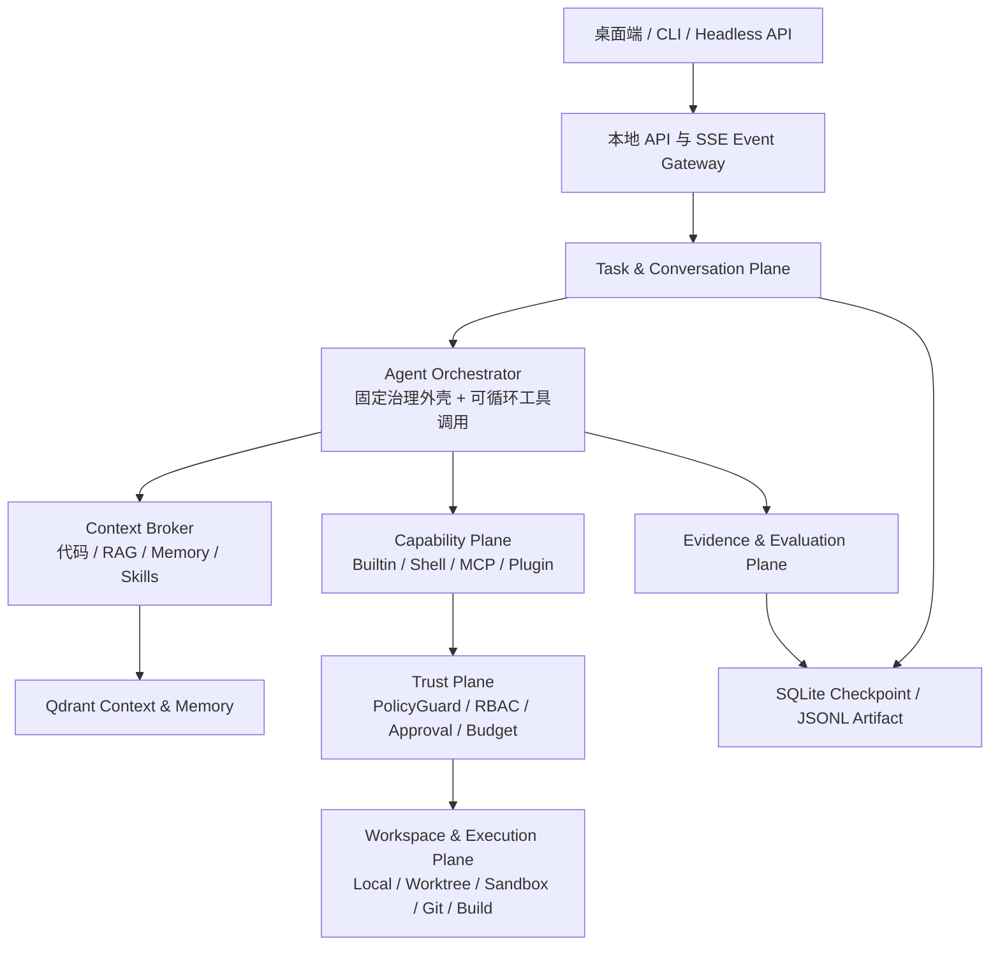

# RepoPilot 企业级通用 Coding Agent 产品需求文档

> 版本：v2.0（规划稿）
> 更新日期：2026-07-31
> 当前实现基线：v0.1.20（本地桌面 MVP）
> 产品形态：Local-first 桌面端 + 本地 API + CLI/Headless

## 0. 文档目的与产品事实

本文档定义 RepoPilot 从“面向 Java/Spring Boot 仓库维护的安全 Agent MVP”，迭代为“面向个人开发者与企业研发团队的通用 Coding Agent 平台”的目标、边界、架构与交付顺序。

RepoPilot 的体验与架构思想参考 Codex、Grok Build 等本地编程 Agent：围绕本地项目、长程任务、工具调用、会话恢复、扩展能力和可观察执行构建产品。但 RepoPilot **不是任何现有项目的源码二次开发**，也不以复刻某个产品的全部能力为目标。

### 0.1 已实现基线（v0.1.20）

以下能力已经存在，是后续迭代的基础，而非本 PRD 的未来承诺：

- Windows `Tauri + React + TypeScript` 桌面端，本机 FastAPI/SSE 服务与 CLI 调试入口；
- 普通多轮对话、流式输出、会话首句命名、重命名、回复复制、从回复分支对话、会话独立摘要；
- 本地项目注册、Git 基线快照、Local/Worktree 工作区、任务恢复和 SQLite checkpoint；
- `安全隔离修复 = Worktree + safe`、`完全本机控制 = Local + full` 两种任务模式；
- LangGraph 编排的“研究 -> 计划 -> 两级审批 -> 结构化补丁 -> Maven/Gradle 验证 -> Diff/报告”闭环；
- Java/XML/Markdown/TXT RAG、Qdrant 上下文索引、SQLite 状态库、JSONL Evidence；
- 内置代码工具、受控 Maven/Gradle Recipe、结构化补丁原子校验、`PolicyGuard`；
- 任务取消会主动取消 OpenAI-compatible Provider 的异步模型请求；迟到模型响应不能回写计划、补丁或验证状态；
- `SKILL.md` 渐进加载、插件完整性校验、MCP STDIO/Streamable HTTP 客户端与任务级只读绑定；
- Java/Maven 维护评测、Java/Gradle、Python/pytest 与 Node.js/npm 最小闭环测试，以及本地安装包发布流程。

当前版本已交付受任务确认、冻结命令预览和独立风险审批约束的完全本机 Shell 与 `git commit/push`，以及三角色并行只读子 Agent 和 PDF/DOCX 受控解析；仍未交付任意语言验证 Profile、企业身份体系、云端协作控制面、插件市场或生产级 OS 沙箱。后续 UI、README、简历、发布说明必须以本节为事实边界。

## 1. 产品愿景

### 1.1 一句话定位

RepoPilot 是一个 **Local-first、可扩展、可治理、可验证的通用 Coding Agent**：开发者可以像与一名工程师协作一样，让它理解本地代码库、调用工具、编写和验证改动；个人用户获得高效的编程体验，团队获得可控权限、证据、策略和审计。

### 1.2 核心承诺

1. **以项目为中心**：所有代码理解、修改、命令、检索和记忆都绑定明确项目、工作区和基线，而不是对整台电脑做隐式扫描。
2. **开放能力，不开放边界**：模型可以在授权能力中反复研究、调用工具、修正方案；但权限、路径、预算、审批和审计由模型外的运行时强制控制。
3. **结果以证据为准**：不能只根据模型文本宣称“修复成功”。修改成功需要真实 Diff；验证成功需要真实命令和测试证据；证据不足必须如实标为 `UNVERIFIED`、`BLOCKED` 或 `FAILED`。
4. **默认安全，按需放权**：默认在 Worktree 内工作；用户可对单个任务显式授予完整项目控制权，但不会因一句提示词或一个 Skill 自动升级权限。
5. **从单机走向企业**：单机运行、离线可用、可选模型供应商是第一原则；企业版在此基础上叠加身份、策略、审计、密钥、可观测性和团队治理，而不是把核心代码直接交给云端。

### 1.3 目标用户

| 用户 | 主要问题 | RepoPilot 价值 |
|---|---|---|
| 个人开发者/学生 | 需要理解项目、修 Bug、实现小需求，但不希望 Agent 无边界改电脑 | 一键选择项目、可见过程、可回退的工作区和测试证据 |
| Java/Python 后端工程师 | 需要重复处理 Controller/Service/测试/构建/文档等工程任务 | 语言 Profile、Skill、RAG、命令验证和可重放任务 |
| Tech Lead/架构师 | 希望把团队规范、构建方式、审查要求注入 Agent | 项目规则、Skill、策略、计划审批、证据报告 |
| 企业平台/安全团队 | 需要控制 MCP、插件、密钥、模型和审计边界 | Capability Registry、Policy-as-Code、审批、留痕与导出 |

## 2. 产品范围与非目标

### 2.1 v2 目标范围

- 通用本地代码任务：理解、定位、修改、重构、小需求、测试补充、文档生成、代码审查和 Git 辅助；
- 可循环的 Agent Runtime：模型可在预算内自主选择已授权工具、读取结果、继续研究或结束；
- 多语言 Profile：Java/Maven 是深度基线，逐步支持 Python、Node.js、Gradle 和更多语言/构建工具；
- 内置工具、Shell、MCP、Skill、插件统一进入能力注册、策略、审批和证据体系；
- 桌面端、CLI、Headless/API 共享同一任务模型，后续可接入 CI 和团队控制面；
- 企业治理能力按阶段进入：组织策略、身份、密钥托管、审计导出、预算和可观测性。

### 2.2 明确非目标

- 不把 RepoPilot 做成 IDE 的替代品，不重做编辑器、Git 托管平台或 CI/CD；
- 不默认获得全盘读写、管理员权限、凭证访问、生产发布或无人值守合并能力；
- 不将“完全权限”理解为绕过安全模块。它只是放宽已授权项目范围内的工具限制，仍受用户确认、超时、取消、审计和硬拒绝规则约束；
- 不将第三方 MCP、插件、Skill、网页、Issue、代码注释当作可信指令；
- 不在没有适配、测试和评测的情况下宣称支持某个语言或框架；
- 不以多 Agent、云端执行、自动部署、插件市场为 v2.0 的前置交付条件。

## 3. 关键产品决策

### 3.1 固定治理外壳 + 开放 Agent 工具循环

现有 MVP 的固定 LangGraph 流程保证安全但对通用任务不够灵活。v2 采用“两层编排”：

```text
确定性治理外壳
  任务创建 -> 环境与权限冻结 -> 审批关卡 -> 结果归档
                          |
                          v
可循环 Agent 内核
  观察上下文 -> 模型决策 -> 调用已授权工具 -> 观察结果 -> 继续 / 请求审批 / 结束
```

- **外壳**由代码控制，不允许模型跳过：项目绑定、权限冻结、策略检查、预算、审批、取消、状态机和报告；
- **内核**允许模型自由选择下一步，但只能调用当次任务已经注册的工具；
- 每一轮必须有可观察的目标、工具输入摘要、输出摘要和停止原因；
- 循环在最终回答、需要审批、达到预算、工具/模型故障、用户取消或策略拒绝时停止；
- 不采用“无限工具调用直到模型自己满意”的设计。

### 3.2 项目边界优先于模型能力

Agent 的工作范围由以下事实共同确定：

```text
项目注册根目录
  + 当前工作区（Local / Worktree）
  + 任务基线（Git ref 或目录快照）
  + 任务模式与权限快照
  + 已批准能力及其参数范围
  + 组织/项目 Policy
= 本次任务可见、可读、可写、可执行的边界
```

模型提示词、用户聊天、RAG 文档、Skill 内容和 MCP 返回值都只能影响“建议做什么”，不能修改上述边界。

### 3.3 通用不等于无约束

对于专业开发者，开放 Shell、MCP、插件和多语言工具是必要能力；对于企业，关键是让这些能力具备最小权限、可解释、可取消和可追责的运行方式。RepoPilot 的差异化不是“禁止 Agent 做事”，而是让用户清楚知道 **它在哪个目录、用什么权限、执行了什么、为什么得出这个结论**。

## 4. 任务模式与权限模型

### 4.1 面向用户的三种模式

| 产品模式 | 目标工作区 | 适用场景 | 默认权限 | 写入与命令 |
|---|---|---|---|---|
| 安全隔离修复 `SAFE_ISOLATED` | Git detached Worktree | 修 Bug、小需求、评测、首次使用项目 | 最小权限 | 写入/测试需审批；不提供任意 Shell |
| 完全本机控制 `FULL_LOCAL` | 用户选择的项目根目录 | 熟悉项目后的复杂开发任务 | 项目级完整权限 | 可使用已启用的 Shell、编辑、Git 与网络能力，均留痕 |
| 企业托管执行 `MANAGED` | Worktree、容器或企业执行池 | 团队任务、受控自动化、CI | 组织策略决定 | 平台策略、角色与审批优先于个人偏好 |

`MANAGED` 是 v2 后期目标，不在当前桌面 MVP 中伪装为已实现能力。

### 4.2 安全隔离修复

- 默认模式；Git 项目在指定基线创建 detached Worktree，原工作目录不被 Agent 写入；
- 只读研究工具自动允许，修改、测试、创建分支、交接等动作必须逐项审批；
- 拒绝访问仓库外路径、敏感文件、任意 Shell、删除、提交、推送和未批准 MCP；
- 源项目 dirty 时默认阻断或要求用户显式选择迁移可见改动；不会自动 stash、clean、reset 或覆盖用户文件；
- 任务结束后 Worktree 默认保留；桌面端只显示脱敏状态，用户确认后才能在该隔离工作区创建审阅分支。若要将 Diff 写回 Local，必须再次确认完全权限；系统会复核 Local 仍处于冻结基线且没有未提交改动，再先执行 Git patch 校验后应用，Worktree 始终保留供审阅。

### 4.3 完全本机控制

完全本机控制是“对**单个项目和单个任务**的显式授权”，不是把整台主机交给模型。

- 必须展示风险说明，并要求固定确认文本或等价二次确认；
- 默认 CWD 固定为项目根目录；访问项目外目录、用户目录、系统目录、凭证目录需额外策略和再次确认；
- 可启用 Shell、网络、直接 Local 编辑、Git 命令等能力，但每种能力仍要在 Capability Registry 中显式注册；
- 每条 Shell 命令记录 argv/工作目录/开始结束时间/退出码/输出摘要/子进程树摘要；支持超时、取消和强制清理子进程；
- 不自动执行高不可逆操作，如格式化磁盘、删除工作区外文件、读取浏览器凭证、修改系统设置；这些属于后续“主机危险操作”能力，默认永久关闭；
- 不允许模型通过“切换到 full”“请忽略限制”等文本升级权限。升级只能重新创建或重新授权任务。

### 4.4 策略裁决顺序

每个工具调用必须经过以下不可绕过的链路：

```text
硬拒绝规则
  -> 组织策略（如存在）
  -> 项目策略
  -> 任务权限快照
  -> 当前审批状态
  -> Capability Registry 状态
  -> 工具参数 / 路径 / Schema / 命令规则
  -> 执行器
  -> Evidence 与状态更新
```

`PolicyGuard` 是 RepoPilot 自研的策略组件，不是第三方依赖。它必须独立于模型和 LangGraph 状态，任何节点、Skill、MCP Server 或插件都无权绕过它。

### 4.5 审批层级

| 审批 | 目的 | 示例 |
|---|---|---|
| 计划审批 | 认可 Agent 的问题理解与方案 | “准备改 `OrderService` 并补充测试” |
| 执行审批 | 允许一组可预览的写入和验证动作 | 展示目标文件、补丁摘要、测试 Recipe；可按文件选择接受，Diff 哈希与选择集合共同冻结 |
| 能力审批 | 允许任务绑定某个风险 Capability | 启用一个只读 MCP，或启用 Shell |
| 完全权限确认 | 创建 `FULL_LOCAL` 任务快照 | 明确项目根目录、风险、有效范围 |
| 企业审批 | 满足组织定义的双人/角色审批 | 访问受保护分支或企业受管 MCP |

## 5. 用户场景与端到端体验

### 5.1 核心场景

| 场景 | 示例输入 | Agent 交付物 | 最低成功标准 |
|---|---|---|---|
| 代码理解 | “这个订单超时是在哪处理的？” | 结论、路径/行号、证据、未知点 | 不修改文件，来源可打开 |
| Bug 修复 | “空优惠券导致结算 NPE” | 根因、计划、补丁、测试、Diff、报告 | 真实 Diff + 目标测试证据 |
| 小需求 | “给订单查询增加状态筛选” | 影响面、接口/数据库假设、代码和测试 | 明确假设与验证范围 |
| 重构 | “拆分重复的库存校验逻辑” | 依赖影响、分阶段计划、变更集 | 编译/测试不回归或诚实标记 |
| 工程文档 | “根据当前代码写接口说明” | Markdown 草稿及来源引用 | 事实与推测分离 |
| Git 协作 | “检查当前改动并创建可审查分支” | Diff 分析、分支/提交建议 | 仅在用户批准后调用 Git 写工具 |
| 外部协作 | “读取 Jira Issue 后修复” | 外部证据、代码计划与执行证据 | MCP/连接器经过授权与审计 |

### 5.2 对话与任务分离

- **普通对话**：无需项目，可用于技术问答、PRD 草拟、代码片段解释；默认不读取本地文件、不调用工具；
- **项目对话**：绑定项目，可检索代码和文档；只读分析不创建写入任务；
- **执行任务**：从项目对话显式创建，拥有 `task_id`、`thread_id`、工作区、权限快照、预算和 Evidence；
- 会话可重命名、分支、归档和摘要；分支只继承分叉点前的可见消息与必要任务摘要，之后独立压缩，避免上下文相互污染；
- 同一会话同一时刻最多运行一个可写任务；用户可以取消、恢复或创建新分支，而不是静默覆盖旧任务。

### 5.3 Codex 风格的交互原则

- 主界面优先展示用户问题、当前结论、计划、Diff 和验证结果；
- 工具过程默认折叠，用户可逐条展开查看命令、来源、耗时和失败原因；
- 模型文本、工具事件、审批请求、Maven 输出和报告通过 SSE 增量到达；
- `Enter` 发送、`Shift+Enter` 换行，兼容中文输入法组合输入；
- 项目在用户打开目录时自动注册，避免“先注册、再使用”的重复操作；
- 警示应该与风险动作同屏出现，不把全局安全说明藏在设置页面。

## 6. 目标架构

### 6.1 逻辑架构


```mermaid
flowchart TB
    UI["桌面端 / CLI / Headless API"] --> API["本地 API 与 SSE Event Gateway"]
    API --> TASK["Task & Conversation Plane"]
    TASK --> ORCH["Agent Orchestrator\n固定治理外壳 + 可循环工具调用"]
    ORCH --> CTX["Context Broker\n代码 / RAG / Memory / Skills"]
    ORCH --> CAP["Capability Plane\nBuiltin / Shell / MCP / Plugin"]
    CAP --> TRUST["Trust Plane\nPolicyGuard / RBAC / Approval / Budget"]
    TRUST --> EXEC["Workspace & Execution Plane\nLocal / Worktree / Sandbox / Git / Build"]
    ORCH --> EVIDENCE["Evidence & Evaluation Plane"]
    TASK --> STORE["SQLite Checkpoint / JSONL Artifact"]
    CTX --> QDRANT["Qdrant Context & Memory"]
    EVIDENCE --> STORE
```

### 6.2 六个运行时平面

| 平面 | 职责 | 核心对象 |
|---|---|---|
| Task Plane | 对话、任务、审批、恢复、取消、状态机 | `Conversation`、`Task`、`Approval`、`Checkpoint` |
| Agent Plane | 模型调用、循环决策、计划、子任务、停止条件 | `AgentRun`、`ChangePlan`、`ToolCall` |
| Context Plane | 代码索引、文档、记忆、Skill、摘要、预算 | `ContextBroker`、`ContextItem`、`MemoryFact` |
| Capability Plane | 内置工具、Shell、MCP、插件、Profile 的注册与发现 | `CapabilityDescriptor`、`ToolSchema` |
| Trust Plane | 权限、策略、审批、密钥、风险、预算 | `PolicyGuard`、`PermissionSnapshot`、`PolicyDecision` |
| Execution & Evidence Plane | 工作区、进程、Diff、验证、日志、报告、评测 | `Workspace`、`ProcessRun`、`Artifact`、`EvidenceEvent` |

### 6.3 Agent 工作流

```text
INTAKE -> BIND_PROJECT -> FREEZE_CONTEXT_AND_POLICY -> PREFLIGHT
  -> RESEARCH_LOOP
       (检索 / 读文件 / 搜索 / MCP / Shell，均需已授权)
  -> PLAN -> PLAN_APPROVAL
  -> EXECUTION_LOOP
       (编辑 / 命令 / 测试 / 复查，均经策略检查)
  -> REVIEW -> REPORT -> ARCHIVE
```

`RESEARCH_LOOP` 和 `EXECUTION_LOOP` 是开放循环，但不是自由跳转图：只能调用当前阶段可用能力，必须受轮次、工具调用数、Token、时间、成本和输出大小预算限制。写入前必须经过计划与执行审批；执行审批中的文件选择只能是预览补丁路径的非空子集，系统将完整预览 Diff、选择集合及所选子补丁预览的哈希共同冻结，并在落盘前重新校验。紧急/无人值守模式属于企业后续能力，需单独策略设计。

### 6.4 模型与供应商抽象

- 支持 OpenAI-compatible Chat 与 Embedding Provider；配置由环境变量、系统钥匙串或企业密钥服务引用，不写入会话、日志、数据库或仓库；
- 模型层提供能力描述：上下文窗口、工具调用、结构化输出、推理、流式输出、价格/预算信息；
- Agent Runtime 不依赖单一模型厂商。模型不可用、结构化输出失败或用量不可核验时必须返回明确状态，不伪造计划；
- 长上下文并不替代 Context Broker。代码库、Skill、历史消息、工具结果仍需分层筛选、引用、摘要和预算控制；
- 后续支持模型路由：轻量模型用于分类/摘要，强模型用于复杂计划，但必须记录选择原因、实际模型和成本。

## 7. 工作区、代码修改与验证

### 7.1 项目与基线

- 支持 Git 与非 Git 目录注册；Git 项目记录 `HEAD`、分支、dirty 状态和可选 start ref，非 Git 项目记录目录快照与内容哈希；
- 每个任务在开始时冻结项目根、实际 CWD、基线、忽略规则和允许路径；
- Git Worktree 是额外 checkout，不等于自动创建分支；任务完成后可保留、创建分支或显式交接；
- 不允许运行时通过相对路径、符号链接或重新绑定项目根逃逸到工作区外；
- 源仓库在安全隔离模式下必须保持不变，任务完成后用 Git 状态、关键文件哈希和基线复核提供证据。

### 7.2 内置代码工具

所有工具必须有稳定名称、Pydantic 参数模型、风险分类、超时、输出上限、脱敏摘要和测试覆盖。

| 工具类别 | 初始工具 | 要求 |
|---|---|---|
| 发现与阅读 | `list_files`、`search_code`、`find_symbol`、`read_file`、`inspect_build` | 路径过滤、二进制/大文件保护、结果截断；符号查询只接受单个 Java 标识符 |
| 上下文 | `retrieve_context`、`load_skill`、`read_memory` | 强制项目/提交过滤、来源引用、不可信标识 |
| 修改 | `apply_patch`、`create_file`、`rename_path` | 原子校验、目标/旧文本唯一性、预览、Diff |
| 构建验证 | `compile`、`test`、`targeted_test`、语言 Profile Recipe | argv 化、超时、输出限制、结果解析 |
| Git | `git_diff`、`git_status`、`create_branch`、`commit`、`push` | 按权限阶段启用；远端和受保护分支策略独立管理 |
| 系统命令 | `shell` | 仅完全本机控制或企业受管策略下启用 |

### 7.3 结构化编辑优先，Shell 作为扩展能力

首选路径仍是结构化 Patch：预验证路径、文件大小、预期旧文本、候选文件和全部修改后再原子写入。它易于审查、回滚和评测。

当通用开发任务确实需要脚本、格式化器、生成器或语言原生命令时，允许在 `FULL_LOCAL` 中启用 Shell Tool：

- 模型提交的是结构化命令请求，不是绕过运行时的字符串执行；
- 每次命令都有 CWD、环境变量白名单、超时、最大输出、取消令牌和进程树清理策略；
- 禁止隐式 shell 拼接；优先 argv 执行，只有明确需要管道/重定向时才使用受控 shell 模式并标记高风险；
- 命令不会继承或打印密钥；环境仅注入已批准的变量名；
- 高风险命令、网络访问、包安装、删除、Git push 需要单独审批或企业策略许可；
- 命令失败是正常证据，不应由模型文本掩盖。

### 7.4 语言 Profile

Profile 是“语言/生态的工程契约”，不是只靠 prompt 的标签。每个 Profile 至少声明：

- 项目识别规则、忽略规则、可索引文件和敏感文件；
- 代码搜索/符号/诊断适配；
- 允许的构建、测试、格式化、静态检查 Recipe；
- 测试结果解析、常见输出归因和报告模板；
- 适用的 Skills、工具依赖、评测任务和版本兼容性。

交付顺序：`Java + Maven` 深度维护 -> `Java + Gradle` 最小闭环（已完成） -> `Python + pytest` 最小闭环（已完成） -> `Node.js + npm` 最小闭环（已完成） -> pnpm 与各 Profile 的跨模型独立评测 -> 其他 Profile。pnpm 仅在本机运行时存在时执行，否则明确阻断；未匹配 Profile 的项目可进入通用研究模式，但不得假装具备可验证修改能力。

### 7.5 成功状态契约

| 状态 | 含义 | 关键证据 |
|---|---|---|
| `PASSED` | 改动完成且验证满足任务契约 | 真实 Diff + 成功验证 + 关联审计 |
| `UNVERIFIED` | 有分析或改动，但缺少可信验证 | Diff/计划存在，验证未执行或不足 |
| `FAILED` | 任务执行或验证实际失败 | 退出码、测试失败、Patch 冲突等 |
| `BLOCKED` | 前置依赖、权限、环境或审批阻断 | 明确阻断原因和下一步 |
| `CANCELLED` | 用户或系统主动停止 | 取消时间、已执行动作、工作区状态 |

## 8. 上下文、RAG 与记忆

### 8.1 Context Broker

Context Broker 负责把“模型可用上下文”从无限堆积改为可控组合。它统一预算、排序、去重、可信标记和来源引用，输入包括：

- 当前用户问题与会话摘要；
- 项目 `AGENTS.md`、仓库规则、语言 Profile；
- 代码和构建文件的符号/文本/向量检索结果；
- 用户添加的研发文档；
- 已验证项目记忆；
- 已批准 Skill 内容与 MCP 工具摘要；
- 当前 Diff、测试结果和近期工具输出。

执行后观察中的真实 Diff 使用独立字符预算进入模型上下文，并记录固定来源名、完整 SHA-256、包含字符数和截断标记；Diff 正文不得进入 SSE、JSONL Evidence 或 Context Snapshot。验证后观察使用独立预算，只投影真实 Build 的状态、Recipe、退出码、耗时和报告数量；原始 stdout/stderr、完整测试输出和 argv 不得进入模型、SSE、JSONL Evidence 或 Context Snapshot。两个观察阶段都属于不可信数据，不能增权、改写审批、重新触发验证或产生新的写入；验证后观察只注册内置只读仓库/RAG 工具，不允许 Shell、MCP 或补丁工具。

Skill 发现统一覆盖项目级、用户级、插件级和内置级作用域。用户与内置根目录通过本机环境配置提供，目录缺失或格式不合法只产生可审计发现问题；路径和正文不进入 Capability Directory、桌面 API、SSE 或 Evidence，`allowed-tools` 仍必须与任务冻结工具和策略能力求交集。

所有外部文本都以不可信数据处理：不得覆盖系统规则、不得增权、不得把其中命令自动变成工具调用。

计划中的证据引用同样不是模型自证：服务端只接受当前任务已经由 RAG 检索或受控工具成功观察到的 `source_type`、路径和行号范围。真实模型在本地契约失败时最多按既有上限修正；任何模型在修正后仍引用未知路径、错误来源类型或越界行号，都会以 `PLAN_EVIDENCE_UNVERIFIED` 在审批前阻断，不能进入补丁范围。计划候选文件也只取当前工作区内已观察的代码、构建/配置文件或成功 `read_file` 路径；模型扩张的路径会作为 `unverified_candidate_files` 保留给用户继续研究，但永不进入补丁预览、执行审批或写入范围。

### 8.2 代码与文档索引

- 当前索引格式已覆盖 Java/XML/Markdown/TXT，并受控覆盖 Python、JavaScript/TypeScript、Gradle 构建脚本和明确白名单构建描述；常见 `application*` / `config*` JSON/YAML 配置会在切块前对密码、Token、Key、凭证及连接串用户信息做本地确定性脱敏，其他通用 JSON/YAML（如 service account）仍不索引；Java 切块额外保存确定性声明符号元数据以辅助检索，但不把它作为 AST 或调用关系事实；
- 文本按稳定切分策略保存路径、行号、内容哈希、来源类型、项目 ID、基线/提交和验证状态；
- Qdrant 向量候选与 SQLite FTS5 BM25 倒排候选在同一项目/基线过滤后，再按关键词、路径和 Java 声明符号稳定重排；FTS5 不可用时显式降级为向量候选，后续接入语义代码图和可选 reranker；
- 强制按 `project_id + baseline` 过滤，防止不同项目、不同提交或不同 Worktree 的上下文串扰；
- 文件大小、二进制、构建产物、忽略规则、敏感路径和用户选择共同决定是否进入索引；
- 文档上传支持 MD/TXT/PDF/DOCX：PDF/DOCX 先解析为受控 UTF-8 文本副本，拒绝加密 PDF、无文本扫描件、异常 DOCX 压缩包和超限内容；源文件绝对路径和二进制原文不进入 RAG Payload。

### 8.3 三层记忆

| 层级 | 存储 | 内容 | 生命周期 |
|---|---|---|---|
| 短期任务记忆 | SQLite checkpoint | 图状态、审批、近期工具摘要、待恢复动作 | 单个 `thread_id` |
| 会话记忆 | Conversation Store | 用户对话、分支点、模型可见摘要 | 会话/分支独立 |
| 长期项目记忆 | Qdrant + 事实记录 | 已验证架构事实、约定、任务总结 | 绑定项目、来源、时效与撤销 |

模型推测、失败结论、未经审查的网页内容不得写入长期项目记忆。每条事实必须带来源、写入者、时间、可信级别和撤销机制。

## 9. Skills、MCP 与插件

### 9.1 Skills

Skill 用 `SKILL.md + YAML frontmatter` 描述可复用工程知识与操作流程，例如“Spring Boot 接口变更检查”“MyBatis Mapper 测试”“Python 发布前检查”。

- 作用域：项目级优先于用户级，用户级优先于内置级；
- 渐进披露：先暴露名称、描述、风险与哈希；命中后才加载正文，避免无关上下文挤占模型窗口；
- Skill 的 `allowed-tools` 是请求，不是授权；实际工具是 Skill、任务权限、组织策略和 Capability Registry 的交集；
- Context Snapshot 记录 `allowed_tools` 与 `effective_tools`：后者严格等于 Skill 请求、任务冻结绑定和策略允许能力的交集，恢复任务时以快照为准；
- Skill 内容、脚本引用和参考资料均是不可信数据；默认不执行 Skill 内脚本；
- Skill 必须可版本化、可审查、可禁用，并在 Evidence 中记录其哈希和使用情况。

### 9.2 MCP

RepoPilot 是 MCP Client/Host，不把内置代码工具伪装成 MCP Server。当前内置 `list_files`、`search_code`、`find_symbol`、`read_file`、结构化 Patch、Maven/Gradle Recipe 等仍是进程内受控工具；MCP 用于接入外部能力，例如 Issue、代码托管、文档、数据库只读查询或企业知识库。

- 支持 STDIO 和 Streamable HTTP Transport；
- MCP 配置仅引用环境变量名、系统钥匙串项或企业密钥引用，禁止内联 token/header/password；
- 工具进入模型前必须完成连接探测、命名空间、Schema、风险标签、输出限制、策略与审批校验；
- 命名空间统一为 `mcp__<server>__<tool>`，避免工具同名劫持；
- Server instructions、工具返回、网页文本均为不可信输入；
- 安全隔离模式默认不启动任意 STDIO 扩展进程；完全本机控制也不能跳过 Schema 和审计；
- 当前单 Runtime 的单服务 Actor 已具备有界 FIFO 队列：突发调用超过本地等待上限时返回 `MCP_SERVER_BUSY`，不将健康连接误判为失败或触发熔断；关闭会等待已接受调用完成。同一任务的 MCP Runtime 固定在专用事件循环内，且只在 `thread_id + 工作区 + 配置来源 + 配置哈希 + 权限模式` 一致时复用；终态或取消后关闭，绝不跨任务共享。已启用且完整性通过的插件快照可以作为 `plugin:<id>` 配置来源，绑定时冻结插件包哈希、配置哈希和工具 Schema；禁用、回退、篡改或来源漂移会阻断调用，同名 `mcp__server__tool` 来源冲突时 fail-closed。后续实现 OAuth、服务器 allowlist、跨任务连接池、Artifact 化大输出、进程/组织级并发配额和企业代理。

### 9.3 插件

插件是 Skill、MCP 配置、语言 Profile、Hook 声明和 UI 元数据的可安装包，不拥有独立权限通道。

- 安装前校验清单、来源、版本、完整性哈希和 detached Ed25519 签名；`requires_repopilot` 支持受限 SemVer 兼容性约束，不兼容版本 fail-closed；签名必须覆盖除 `repopilot-plugin.sig` 外的完整包哈希；可选 Git 来源锁将无凭据 `origin` 与完整提交哈希写入并签名保护的 `.sig`，安装时仅复核本地 checkout，绝不联网拉取；
- 发布者私钥只允许由本地 CLI 从显式 PEM 文件短暂读取；用户只在本机 SQLite 信任库登记 Base64 原始 Ed25519 公钥。缺失签名、未知发布者、签名或包哈希不匹配时，插件不能进入 Skill/MCP 运行时能力集；撤销信任必须立即收回资格并记录审计；
- 桌面端必须展示插件的完整性、兼容性、签名状态与发布者 ID；可信发布者管理只展示公钥指纹，支持本机登记和撤销，且不通过界面、SSE、Evidence 或日志回显完整公钥或私钥；
- 安装、启用、禁用、升级、移除均写入审计；
- 插件脚本默认不执行，MCP 默认不自动连接；
- Hook 只能返回结构化建议、风险或 `allow/ask/deny`，硬拒绝和策略结果不可被覆盖；
- 企业可配置插件仓库、来源锁定、版本准入和 allowlist。

## 10. 企业治理与安全要求

### 10.1 身份与权限（后续企业控制面）

- 桌面本地模式使用 OS 用户和本地配置；企业模式接入 SSO/OIDC、组织/团队/项目/角色模型；
- 权限至少覆盖：项目访问、任务创建、full 模式、Shell、网络、MCP、插件、密钥引用、Git 写操作、审计导出；
- 策略按“组织 -> 团队 -> 项目 -> 任务”收紧，低层不能放宽高层硬拒绝；
- 高风险操作支持双人审批、时间窗、审批过期和事后复核。

### 10.2 密钥与数据保护

- API Key、MCP 凭证、企业令牌不得进入 Git、`.env.example`、日志、Evidence、错误栈、SSE 或模型上下文；
- 本地开发可通过环境变量注入；桌面正式版优先使用系统钥匙串；企业版对接密钥服务；
- 对命令、工具参数、Diff、文件内容、截图和报告分别定义脱敏与保留策略；
- 用户可选择本地模型/本地 Embedding/本地 Qdrant，企业可配置模型网关与数据驻留策略；
- 遥测默认最小化：不上传源码正文、提示词正文或密钥，外发前由用户/组织显式启用。

### 10.3 审计、可观察性与合规

每个任务至少有一个 Trace ID，关联：

- 用户、项目、工作区、基线、权限和审批；
- 模型/版本、成本/Token 摘要、节点耗时和预算事件；
- 工具、MCP、Shell、命令、CWD、退出码、输出摘要和策略裁决；
- RAG/Skill/Memory 来源、哈希、截断和可信标签；
- Patch、Diff、测试、报告、取消和恢复行为。

Evidence 默认追加写入 JSONL，并可归档到任务 Artifact；后续企业版支持不可变归档、保留期、查询、导出和 OpenTelemetry 兼容 Trace。审计的价值是复盘与追责，不等于记录所有代码正文。

### 10.4 安全边界与威胁模型

必须覆盖并持续评测：提示注入、路径逃逸、符号链接、敏感文件读取、命令注入、MCP 工具投毒、Skill 篡改、插件供应链、恶意大输出、上下文串扰、权限恢复不一致、子进程泄漏、预算耗尽和错误成功报告。

Windows 本地目录边界不是操作系统强沙箱。后续对高风险执行提供容器/虚拟化/Linux sandbox 方案，但在真正实现前不得宣传为“隔离执行”。

## 11. 状态、Evidence、报告与评测

### 11.1 任务状态机

```text
CREATED -> RUNNING -> WAITING_APPROVAL -> RUNNING
                       |                    |
                       v                    v
                    BLOCKED          PASSED / UNVERIFIED / FAILED / CANCELLED
```

恢复任务时必须重验项目根、工作区、基线、模式、权限快照、MCP/Skill 配置哈希和剩余预算。任何不一致都进入 `BLOCKED` 或要求用户重新确认，不能静默继续。

### 11.2 报告标准

每份报告应清楚区分：

1. 用户目标与任务模式；
2. 使用的项目、工作区和基线；
3. 已证实事实、模型假设与未解决风险；
4. 计划、审批记录与实际工具调用；
5. 修改文件、真实 Diff 与变更原因；
6. 执行过的验证、退出码、测试摘要与未覆盖项；
7. 最终状态、后续人工动作和 Artifact 链接。

### 11.3 评测体系

评测不是让模型“自我打分”，而是可重放任务集和硬断言：

- 覆盖 Java、Python、Node.js、Gradle 等 Profile 的理解、修复、需求、重构和文档任务；
- 覆盖安全隔离、完全本机控制、Shell、MCP、Skill、提示注入、权限拒绝、恢复和失败场景；
- 每个任务定义初始项目/基线、用户描述、允许范围、验证 Recipe、预期状态、安全断言和人工审查点；
- 指标包括任务完成率、验证通过率、修改范围准确率、证据覆盖率、策略拦截率、恢复成功率、平均耗时、Token/成本与人工接管率；
- 对不同模型、版本、Profile 和权限模式分别统计，避免把偶然成功当作平台能力。

## 12. 非功能需求

| 维度 | 要求 |
|---|---|
| 可靠性 | 任务可取消、可恢复；进程崩溃后不丢失已落盘审批和 Evidence；失败不伪装成功 |
| 性能 | UI 首次可交互优先；长任务 SSE 持续反馈；索引增量更新；大输出 Artifact 化而非塞入上下文 |
| 可用性 | 桌面端可离线管理项目与查看历史；缺少模型/Qdrant/Maven 时给出可执行的 `BLOCKED` 原因 |
| 可维护性 | 领域模型、Provider、Profile、Capability、Policy 与 UI 解耦；公共接口有契约测试 |
| 可扩展性 | 新语言、新 MCP、新 Skill、新插件不应绕过统一权限、证据和预算机制 |
| 可移植性 | 保持 Windows 优先；后续支持 Linux/macOS，并抽象进程和沙箱实现 |
| 可观测性 | 本地可查看任务时间线、错误、模型/工具耗时、预算；企业可导出标准 Trace |
| 无障碍与体验 | 中文优先、键盘操作完整、风险提示可理解、过程默认折叠、结果优先展示 |

## 13. 分阶段交付路线

### M0：可信 Java/Maven MVP（已完成基线）

- 已交付双模式、Worktree、RAG、计划/执行审批、结构化 Patch、Maven 深度验证，以及 Gradle/Python pytest/Node npm/pnpm 的最小验证 Recipe、桌面端、MCP/Skill 基础；各 Profile 是否可验证仍由当前机器的运行时诊断与评测报告决定；
- 继续修复产品一致性、安装体验、端到端回归和评测质量；
- 验收：现有功能与 README/PRD/安装包一致，所有失败状态可解释。

### M1：通用 Agent Loop 与 Shell Runtime

- 将固定研究链路升级为受预算的开放 Agent Loop；
- 建立统一 Tool Runtime、Shell Process Runtime、命令预览、取消、超时、输出截断和进程树清理；
- 在 `FULL_LOCAL` 提供项目范围内的 Shell，安全隔离模式保持结构化工具优先；
- 将 `PLAN`、`EXECUTION`、`REVIEW` 的能力注册分层冻结；
- 验收：模型能够完成“研究 -> 命令 -> 观察 -> 再研究”的多轮任务；越界路径、未确认 Shell、预算超限、取消后子进程残留均有自动化测试。

### M2：多语言 Profile 与高质量上下文

- 落地 Python/pytest、Node.js/npm/pnpm、Java/Gradle Profile；
- 已完成确定性 Java 符号、混合检索、受预算当前 Diff 上下文和受限测试结果上下文；后续增加语法/调用图感知索引与项目记忆审核；
- 非 Git 项目支持目录快照、受限编辑和验证；
- 验收：每个宣称支持的 Profile 至少有理解、修复、失败、安全四类评测任务和可复现验证。

### M3：Extension Runtime

- 已完成 MCP Agent 绑定、任务级连接复用与大输出 Artifact 化：超过模型上下文预算的 MCP 原文不进入 checkpoint、Evidence 或 SSE，只以 SHA-256 引用保存到经过二次校验的任务 Artifact；后续完成 OAuth/认证、跨任务连接池和服务治理；
- 已完成插件本机受控快照、包哈希版本、源目录隔离、Ed25519 签名/本机可信发布者校验、显式回退、任务级只读 MCP 绑定、`requires_repopilot` 兼容性声明，以及签名保护的本地 Git checkout 来源锁；后续完成远程插件市场、自动升级和企业来源准入；
- 将 Skill 变成可审查、可评测的工程流程资产；
- 验收：恶意 MCP/Skill/插件不能提升权限或污染任务；第三方能力可独立禁用、审计和复现。

### M4：团队与企业控制面

- 引入组织、项目、角色、策略继承、SSO/OIDC、密钥管理、审批流和审计导出；
- 引入受管执行池、容器/沙箱策略、远程任务/CI Headless 接入；
- 增加预算、模型路由、配额、SLO、OpenTelemetry 和管理员控制台；
- 验收：组织策略能够阻断本地用户/模型的越权调用；审计可按任务完整还原；不同项目和租户无上下文或密钥串扰。

### M5：1.0 产品化

- 打磨稳定更新、崩溃恢复、安装诊断、数据迁移、兼容性和发布签名；当前桌面端已对 `settings.env` 提供幂等的追加式字段迁移，旧配置的密钥与模型值不会被覆盖；仍需完成跨版本安装包升级与长期多次启动验收；
- 建立持续评测、回归门禁、安全红队和用户反馈闭环；
- 对外发布稳定 Profile、扩展规范、API/CLI 文档和企业部署指南；
- 验收：在明确支持的环境与任务集上有可重复质量指标、安装包和可追溯发布记录。

## 14. 优先级与近期实施清单

### P0：下一轮必须完成

1. 统一 `ToolRuntime` 与 Capability Registry，补齐每类工具的风险、预算、审计和取消契约；
2. 实现项目范围 Shell Runtime，并以 Feature Flag 限定 `FULL_LOCAL`；
3. 将 LangGraph 改造成固定外壳下的预算化 Agent Loop；
4. 完善任务状态与恢复一致性校验，修复 UI/API/文档状态不一致；当前终态任务归档会将已脱敏 SSE 历史写入带 SHA-256 的 `event_archive` 产物，再释放 SQLite 中的历史事件行；已提供按更新时间和容量元数据的只读归档预演，以及必须显式确认的批量归档入口。归档后仍按原 `sequence` 回放，归档损坏必须显式阻断，当前不实现自动删除 checkpoint、报告或证据。
5. 给 Shell、权限、工作区、审批、恢复写端到端回归测试。

### P1：紧随其后

1. Python/pytest Profile 与可重放评测；
2. 代码符号索引、混合检索、Diff/测试上下文进入 Context Broker；
3. MCP 工具在 Agent Loop 中的显式任务级绑定、输出 Artifact 化与服务治理；
4. Skill/插件远程来源锁定、版本锁定与审查 UI；
5. Headless CLI/CI 任务入口与机器可读报告。

### P2：企业能力

1. OIDC/RBAC、组织策略、企业密钥管理和审批；
2. 容器/受管执行池、网络出口控制和更强隔离；
3. OpenTelemetry、模型网关、预算和配额；
4. Linux/macOS 支持、自动更新、签名与 SBOM；
5. 企业部署、数据保留和合规能力。

## 15. 验收总则与发布门槛

每次新增能力必须同时满足以下条件，才能在 README 或简历中宣称“已支持”：

1. **能力存在**：有可调用实现、稳定接口和用户入口；
2. **边界存在**：有权限、路径、参数、超时、输出和错误处理；
3. **证据存在**：有 Evidence、状态和可读报告；
4. **测试存在**：至少有正常、失败、越权/安全、恢复或取消相关测试；
5. **评测存在**：进入可重放任务集或有等价端到端验证；
6. **文档真实**：标明已实现、实验性或规划中，不能用路线图代替交付事实。

发布前至少运行与改动相关的单元/集成测试、`git diff --check`、桌面端构建与关键用户流验证。涉及 Shell、MCP、插件、权限、密钥、网络、Git 写入或企业策略的改动，必须额外提供安全回归与人工 Diff 审查。

## 16. 面向面试和演示的准确表述

当前阶段可准确表述为：

> RepoPilot 是一个 Local-first 的可审计 Coding Agent MVP。我以 Java/Maven 维护任务为首条深度路径，使用 LangGraph 编排可恢复的研究、计划、审批、补丁和验证流程；使用 Worktree、PolicyGuard、结构化工具和 Evidence 把模型建议与真实执行结果分离；同时完成了 RAG、Skill、MCP 连接治理和 Tauri 桌面端基础。下一步将把固定研究工作流升级为受治理的开放 Agent Tool Loop，并通过多语言 Profile、Shell Runtime 与企业策略控制扩展为通用编程助手。

不要表述为“已经实现企业级平台”“已经像 Codex 一样拥有无限制 Shell”或“已经支持全部语言”。企业级的含义是持续可验证的架构、边界和交付质量，而不是功能名称堆叠。
